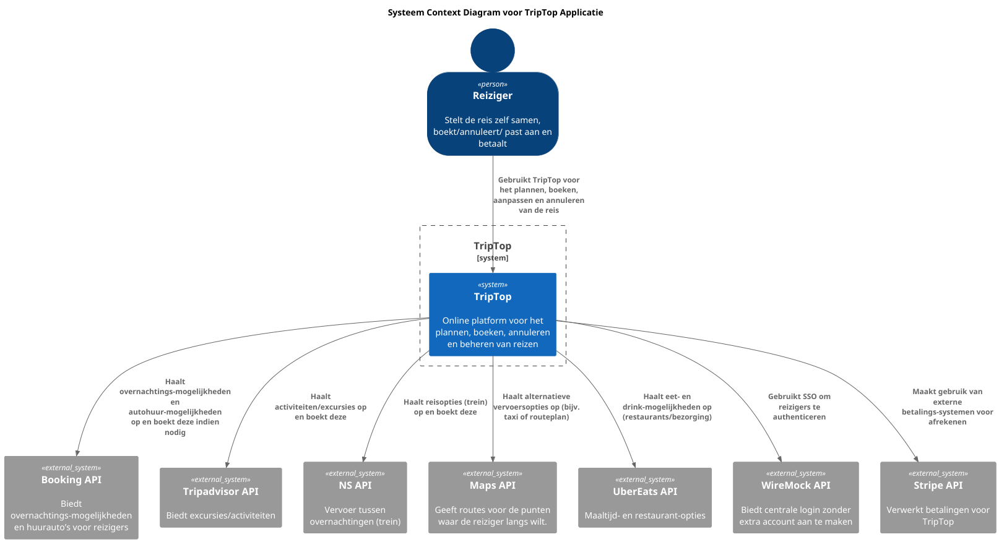

# Software Guidebook Triptop

## 1. Introduction
Dit software guidebook geeft een overzicht van de Triptop-applicatie. Het bevat een samenvatting van het volgende: 
1. De vereisten, beperkingen en principes. 
1. De software-architectuur, met inbegrip van de technologiekeuzes op hoog niveau en de structuur van de software. 
1. De ontwerp- en codebeslissingen die zijn genomen om de software te realiseren.
1. De architectuur van de infrastructuur en hoe de software kan worden geinstalleerd. 

## 2. Context

Triptop is een online platform dat reizigers in staat stelt om reizen zelfstandig te plannen, boeken, annuleren en beheren zonder tussenkomst van een reisbureau. Het platform integreert met diverse externe diensten voor accommodaties, vervoer, activiteiten en betalingen.

### 2.1 System Context Diagram

Het onderstaande diagram toont de context van Triptop, inclusief de gebruikers en externe systemen waarmee het interacteert:

#### Gebruikers:
* **Reiziger**: Plant, boekt, annuleert en beheert reizen zelfstandig op basis van persoonlijke voorkeuren.
* **Reis Agent**: Biedt tweedelijns ondersteuning aan reizigers met vragen of problemen.

#### Externe Systemen:
* **Overnachtingen** (Booking): Leveren accommodatiemogelijkheden.
* **Autohuur** (Booking): Bieden huurauto-opties voor reizigers.
* **Activiteiten** (Tripadvisor): Leveren excursies en activiteiten op locatie.
* **Vervoer** (Deutsche Bahn): Zorgen voor vervoersopties tussen overnachtingslocaties.
* **Routeplanner** (Google Maps API): Genereert routes voor de gewenste reispunten.
* **Eten & Drinken** (UberEats API): Bieden maaltijd- en restaurantopties.
* **Identity Provider** (WireMock): Zorgt voor centrale aanmelding zonder extra account.
* **BetalingsProvider** (Stripe API): Verwerkt betalingen voor boekingen.

## 3. Functional Overview

Om de belangrijkste features toe te lichten zijn er user stories en twee domain stories gemaakt en een overzicht van het domein in de vorm van een domeinmodel. Op deze plek staat typisch een user story map maar die ontbreekt in dit voorbeeld.

### 3.1 User Stories

#### 3.1.1 User Story 1: Reis plannen

Als gebruiker wil ik een zelfstandig op basis van diverse variabelen (bouwstenen) een reis kunnen plannen op basis van mijn reisvoorkeuren (wel/niet duurzaam reizen, budget/prijsklasse, 's nachts reizen of overdag etc.) zodat ik op vakantie kan gaan zonder dat hiervoor een reisbureau benodigd is.

#### 3.1.2 User Story 2: Reis boeken

Als gebruiker wil ik een geplande reis als geheel of per variabele (bouwsteen) boeken en betalen zodat ik op vakantie kan gaan zonder dat hiervoor een reisbureau benodigd is.

#### 3.1.3 User Story 3: Reis cancelen

Als gebruiker wil ik een geboekte reis, of delen daarvan, kunnen annuleren zodat ik mijn geld terug kan krijgen zonder inmenging van een intermediair zoals een reisbureau.

#### 3.1.4 User Story 4: Reisstatus bewaren 

Als gebruiker wil ik mijn reisstatus kunnen bewaren zonder dat ik een extra account hoef aan te maken zodat ik mijn reis kan volgen zonder dat ik daarvoor extra handelingen moet verrichten.

#### 3.1.5 User Story 5: Bouwstenen flexibel uitbreiden

Als gebruiker wil ik de bouwstenen van mijn reis flexibel kunnen uitbreiden met een zelf te managen stap (bijv. met providers die niet standaard worden aangeboden zoals een andere reisorganisatie, hotelketen etc.) zodat ik mijn reis helemaal kan aanpassen aan mijn wensen.

### 3.2 Domain Story Reis Boeken (AS IS)

### 3.3 Domain Story Reis Boeken (TO BE)

### 3.4 Domain Model

## 4. Quality Attributes

Voordat deze casusomschrijving tot stand kwam, heeft de opdrachtgever de volgende ISO 25010 kwaliteitsattributen benoemd als belangrijk:
* Compatibility -> Interoperability (Degree to which a system, product or component can exchange information with other products and mutually use the information that has been exchanged)
* Reliability -> Fault Tolerance (Degree to which a system or component operates as intended despite the presence of hardware or software faults)
* Maintainability -> Modularity (Degree to which a system or computer program is composed of discrete components such that a change to one component has minimal impact on other components)
* Maintainability -> Modifiability (Degree to which a product or system can be effectively and efficiently modified without introducing defects or degrading existing product quality)
* Security -> Integrity (Degree to which a system, product or component ensures that the state of its system and data are protected from unauthorized modification or deletion either by malicious action or computer error)
* Security -> Confidentiality (Degree to which a system, product or component ensures that data are accessible only to those authorized to have access)

## 5. Constraints

> [!IMPORTANT]
> Beschrijf zelf de beperkingen die op voorhand bekend zijn die invloed hebben op keuzes die wel of niet gemaakt kunnen of mogen worden.

## 6. Principles

> [!IMPORTANT]
> Beschrijf zelf de belangrijkste architecturele en design principes die zijn toegepast in de software.

## 7. Software Architecture

###     7.1. Containers
Het volgende diagram toont de hoofdcomponenten van het Triptop-systeem en hun interacties:

#### Hoofdcomponenten:
* **Frontend**: React/JavaScript applicatie die gebruikers in staat stelt om reizen te plannen, boeken en beheren.
* **Backend**: Java/Spring Boot applicatie die boekingen verwerkt, bouwstenen beheert en externe diensten integreert.
* **Database**: Slaat reis- en gebruikersgegevens op.

De container diagram toont in meer detail hoe Triptop integreert met de verschillende externe diensten via API's en hoe de interne componenten met elkaar communiceren.
### 2.2 Dynamische Container Diagram
### 7.2.1  Inloggen

Toelichting

    Gebruiker voert inloggegevens in:
    De gebruiker typt zijn gebruikersnaam en wachtwoord in de Frontend (de gebruikersinterface gebouwd met React). Deze stap vindt plaats via een beveiligde HTTPS-verbinding.

    Verzenden van het inlogverzoek:
    De Frontend stuurt het inlogverzoek (in JSON-formaat) naar de Backend, die is gebouwd met Java en Spring Boot.

    Authenticatie door de externe identiteitprovider:
    De Backend stuurt het verzoek door naar de WireMock API, die in dit geval een externe service is die de centrale identiteitsverificatie en SSO (Single Sign-On) simuleert. Deze service controleert de inloggegevens en retourneert een token en gebruikersinformatie.

    Ophalen en verwerken van gebruikersdata:
    Na ontvangst van het token vraagt de Backend via JDBC/SQL de bijbehorende gebruikersgegevens op uit de Database.

    Terugkoppeling naar de Frontend:
    De Backend stuurt het token en de profielinformatie terug naar de Frontend, die deze informatie vervolgens toont aan de gebruiker, zodat deze als ingelogd wordt herkend.

### 7.2.2 Reis Boeken

Toelichting

    Selectie van reis:
    De gebruiker kiest via de Frontend (React) de vertrek- en bestemmingslocatie en geeft aan dat hij een reis met vervoer met een huurauto wil boeken. Deze selectie vindt plaats via een HTTPS-verbinding.

    Verzenden van reisgegevens:
    De Frontend stuurt de geselecteerde reisdetails (in JSON) naar de Backend (Java/Spring Boot). Dit omvat informatie zoals de locaties, de gewenste datum en tijd, en de keuze voor een huurauto als vervoersmiddel.

    Route-informatie opvragen:
    De Backend vraagt via de Maps API de routeinformatie op, zoals afstand en reistijd tussen de vertrek- en bestemmingslocatie. De Maps API retourneert deze gegevens weer via HTTPS/JSON.

    Huurauto boeken:
    Vervolgens roept de Backend de Booking API aan om de huurauto te reserveren. Hierbij worden onder andere de start- en einddatum en locatiegegevens meegegeven. De Booking API bevestigt de reservering.

    Betaling verwerken:
    Na de reservering verwerkt de Backend de betaling via de Stripe API. Stripe verwerkt de betaling en retourneert een betaalbevestiging.

    Opslag van de transactie:
    De Backend slaat alle reis-, reserverings- en betalingsgegevens op in de Database (via JDBC/SQL).

    Terugkoppeling naar de gebruiker:
    Ten slotte stuurt de Backend een definitieve bevestiging, inclusief reserveringsnummer en betaalstatus, terug naar de Frontend. De Frontend toont deze bevestiging aan de gebruiker.

    Herstart van het proces:
    Indien de betaling mislukt, zal de gebruiker de boeking opnieuw moeten maken, omdat de data pas wordt opgeslagen in de database nadat de betaling is afgerond.

###     7.2. Components

> [!IMPORTANT]
> Voeg toe: Component Diagram plus een Dynamic Diagram van een aantal scenario's inclusief begeleidende tekst.

###     7.3. Design & Code

> [!IMPORTANT]
> Voeg toe: Per ontwerpvraag een Class Diagram plus een Sequence Diagram van een aantal scenario's inclusief begeleidende tekst.

## 8. Architectural Decision Records

> [!IMPORTANT]
> Voeg toe: 3 tot 5 ADR's die beslissingen beschrijven die zijn genomen tijdens het ontwerpen en bouwen van de software.

### **ADR-001: Gebruik van Stripe als betalingsprovider**

**Status:**  
Geaccepteerd

#### **Context**  
Onze TripTop-applicatie moet een betalingssysteem hebben waarmee gebruikers hun reis gemakkelijk kunnen betalen. Andere externe systemen (zoals voor hotels of autohuur) hebben soms hun eigen betaalmethodes, maar dat kan leiden tot een rommelige en onduidelijke gebruikerservaring. Daarom willen we één enkel systeem gebruiken dat voor iedereen werkt.

#### **Decision Forces**

We hebben drie opties overwogen. Hier is een eenvoudige tabel met plussen en minnen om te laten zien wat goed (+) en minder goed (-) is aan elke optie:

| **Optie**                   | **Uniformiteit** | **Veiligheid & Regels** | **Schaalbaarheid** | **Technische Moeilijkheid** | **Afhankelijkheid** | **Kosten** |
|-----------------------------|------------------|-------------------------|--------------------|-----------------------------|---------------------|------------|
| **Stripe**                  | ++               | ++                      | ++                 | +                           | -                   | +          |
| **Externe API-betalingen**  | -                | -                       | -                  | ++                          | ++                  | ++         |
| **Eigen Betaalinfrastructuur** | -             | -                       | -                  | -                           | ++                  | -          |

- **Uniformiteit:** Stripe geeft één manier van betalen voor alle boekingen (++), terwijl externe systemen verschillende methoden hebben (-).
- **Veiligheid & Regels:** Stripe voldoet aan belangrijke regels (zoals PCI-DSS en GDPR) (++), wat bij andere opties vaak niet zo duidelijk is (-).
- **Schaalbaarheid:** Stripe groeit mee als er meer gebruikers komen (++), externe systemen zijn vaak beperkt (-).
- **Technische Moeilijkheid:** Het opzetten van Stripe is relatief makkelijk (+), terwijl eigen oplossingen vaak moeilijker zijn (-).
- **Afhankelijkheid:** Als we externe betaalmethoden gebruiken, zijn we erg afhankelijk van meerdere partijen (++), terwijl Stripe minder afhankelijk maakt (-).
- **Kosten:** Stripe rekent wel kosten per transactie (+), maar dit is acceptabel vergeleken met de nadelen van andere opties (++ of -).

#### **Beslissing**

Wij kiezen voor **Stripe** als onze betalingsprovider.  
- **Waarom?**  
  - Stripe zorgt voor één uniforme betalingsmethode voor alle boekingen.  
  - Het voldoet aan alle belangrijke veiligheidsregels en kan eenvoudig meeschalen.  
  - Het maakt het technisch eenvoudiger en vermindert de afhankelijkheid van meerdere externe partijen.
  
#### **Consequenties**

- Alles wordt via Stripe verwerkt, wat de gebruikerservaring eenvoudiger en consistenter maakt.
-  Stripe voldoet aan alle belangrijke veiligheidsnormen.
-  Naarmate het aantal gebruikers groeit, kan Stripe meeschalen zonder extra moeite.
- Stripe rekent kosten per transactie, wat de marges kan beïnvloeden.
- Als Stripe problemen heeft, heeft dit invloed op onze betalingsverwerking.
- Extra werk is nodig om Stripe goed te integreren en te beheren.

### 8.2. ADR-002 TITLE

> [!TIP]
> These documents have names that are short noun phrases. For example, "ADR 1: Deployment on Ruby on Rails 3.0.10" or "ADR 9: LDAP for Multitenant Integration". The whole ADR should be one or two pages long. We will write each ADR as if it is a conversation with a future developer. This requires good writing style, with full sentences organized into paragraphs. Bullets are acceptable only for visual style, not as an excuse for writing sentence fragments. (Bullets kill people, even PowerPoint bullets.)

#### Context

> [!TIP]
> This section describes the forces at play, including technological, political, social, and project local. These forces are probably in tension, and should be called out as such. The language in this section is value-neutral. It is simply describing facts about the problem we're facing and points out factors to take into account or to weigh when making the final decision.

#### Considered Options

> [!TIP]
> This section describes the options that were considered, and gives some indication as to why the chosen option was selected.

#### Decision

> [!TIP]
> This section describes our response to the forces/problem. It is stated in full sentences, with active voice. "We will …"

#### Status

> [!TIP]
> A decision may be "proposed" if the project stakeholders haven't agreed with it yet, or "accepted" once it is agreed. If a later ADR changes or reverses a decision, it may be marked as "deprecated" or "superseded" with a reference to its replacement.

#### Consequences

> [!TIP]
> This section describes the resulting context, after applying the decision. All consequences should be listed here, not just the "positive" ones. A particular decision may have positive, negative, and neutral consequences, but all of them affect the team and project in the future.

### 8.3. ADR-003 TITLE

> [!TIP]
> These documents have names that are short noun phrases. For example, "ADR 1: Deployment on Ruby on Rails 3.0.10" or "ADR 9: LDAP for Multitenant Integration". The whole ADR should be one or two pages long. We will write each ADR as if it is a conversation with a future developer. This requires good writing style, with full sentences organized into paragraphs. Bullets are acceptable only for visual style, not as an excuse for writing sentence fragments. (Bullets kill people, even PowerPoint bullets.)

#### Context

> [!TIP]
> This section describes the forces at play, including technological, political, social, and project local. These forces are probably in tension, and should be called out as such. The language in this section is value-neutral. It is simply describing facts about the problem we're facing and points out factors to take into account or to weigh when making the final decision.

#### Considered Options

> [!TIP]
> This section describes the options that were considered, and gives some indication as to why the chosen option was selected.

#### Decision

> [!TIP]
> This section describes our response to the forces/problem. It is stated in full sentences, with active voice. "We will …"

#### Status

> [!TIP]
> A decision may be "proposed" if the project stakeholders haven't agreed with it yet, or "accepted" once it is agreed. If a later ADR changes or reverses a decision, it may be marked as "deprecated" or "superseded" with a reference to its replacement.

#### Consequences

> [!TIP]
> This section describes the resulting context, after applying the decision. All consequences should be listed here, not just the "positive" ones. A particular decision may have positive, negative, and neutral consequences, but all of them affect the team and project in the future.

### 8.4. ADR-004 TITLE

> [!TIP]
> These documents have names that are short noun phrases. For example, "ADR 1: Deployment on Ruby on Rails 3.0.10" or "ADR 9: LDAP for Multitenant Integration". The whole ADR should be one or two pages long. We will write each ADR as if it is a conversation with a future developer. This requires good writing style, with full sentences organized into paragraphs. Bullets are acceptable only for visual style, not as an excuse for writing sentence fragments. (Bullets kill people, even PowerPoint bullets.)

#### Context

> [!TIP]
> This section describes the forces at play, including technological, political, social, and project local. These forces are probably in tension, and should be called out as such. The language in this section is value-neutral. It is simply describing facts about the problem we're facing and points out factors to take into account or to weigh when making the final decision.

#### Considered Options

> [!TIP]
> This section describes the options that were considered, and gives some indication as to why the chosen option was selected.

#### Decision

> [!TIP]
> This section describes our response to the forces/problem. It is stated in full sentences, with active voice. "We will …"

#### Status

> [!TIP]
> A decision may be "proposed" if the project stakeholders haven't agreed with it yet, or "accepted" once it is agreed. If a later ADR changes or reverses a decision, it may be marked as "deprecated" or "superseded" with a reference to its replacement.

#### Consequences

> [!TIP]
> This section describes the resulting context, after applying the decision. All consequences should be listed here, not just the "positive" ones. A particular decision may have positive, negative, and neutral consequences, but all of them affect the team and project in the future.

### 8.5. ADR-005 TITLE

> [!TIP]
> These documents have names that are short noun phrases. For example, "ADR 1: Deployment on Ruby on Rails 3.0.10" or "ADR 9: LDAP for Multitenant Integration". The whole ADR should be one or two pages long. We will write each ADR as if it is a conversation with a future developer. This requires good writing style, with full sentences organized into paragraphs. Bullets are acceptable only for visual style, not as an excuse for writing sentence fragments. (Bullets kill people, even PowerPoint bullets.)

#### Context

> [!TIP]
> This section describes the forces at play, including technological, political, social, and project local. These forces are probably in tension, and should be called out as such. The language in this section is value-neutral. It is simply describing facts about the problem we're facing and points out factors to take into account or to weigh when making the final decision.

#### Considered Options

> [!TIP]
> This section describes the options that were considered, and gives some indication as to why the chosen option was selected.

#### Decision

> [!TIP]
> This section describes our response to the forces/problem. It is stated in full sentences, with active voice. "We will …"

#### Status

> [!TIP]
> A decision may be "proposed" if the project stakeholders haven't agreed with it yet, or "accepted" once it is agreed. If a later ADR changes or reverses a decision, it may be marked as "deprecated" or "superseded" with a reference to its replacement.

#### Consequences

> [!TIP]
> This section describes the resulting context, after applying the decision. All consequences should be listed here, not just the "positive" ones. A particular decision may have positive, negative, and neutral consequences, but all of them affect the team and project in the future.

## 9. Deployment, Operation and Support

> [!TIP]
> Zelf beschrijven van wat je moet doen om de software te installeren en te kunnen runnen.