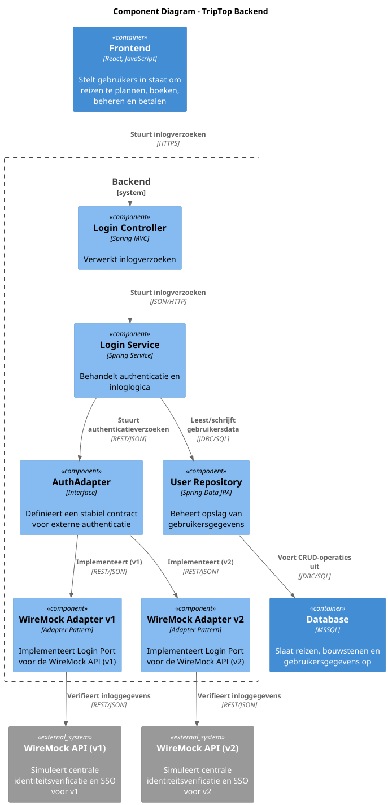
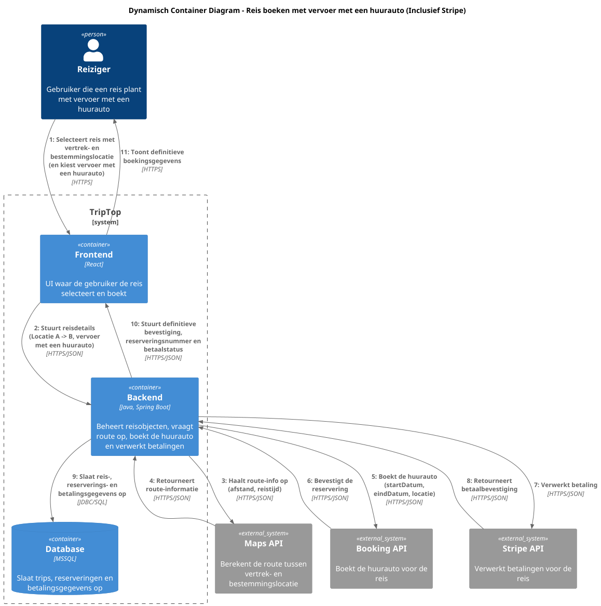

# Software Guidebook Triptop

## 1. Introduction
Dit software guidebook geeft een overzicht van de Triptop-applicatie. Het bevat een samenvatting van het volgende: 
1. De vereisten, beperkingen en principes. 
1. De software-architectuur, met inbegrip van de technologiekeuzes op hoog niveau en de structuur van de software. 
1. De ontwerp- en codebeslissingen die zijn genomen om de software te realiseren.
1. De architectuur van de infrastructuur en hoe de software kan worden geinstalleerd. 

## 2. Context

Triptop is een online platform dat reizigers in staat stelt om reizen zelfstandig te plannen, boeken, annuleren en beheren zonder tussenkomst van een reisbureau. Het platform integreert met diverse externe diensten voor accommodaties, vervoer, activiteiten en betalingen.

### 2.1 System Context Diagram

Het onderstaande diagram toont de context van Triptop, inclusief de gebruikers en externe systemen waarmee het interacteert:


#### Gebruikers:
* **Reiziger**: Plant, boekt, annuleert en beheert reizen zelfstandig op basis van persoonlijke voorkeuren.

#### Externe Systemen:
* **Overnachtingen** (Booking): Leveren accommodatiemogelijkheden.
* **Autohuur** (Booking): Bieden huurauto-opties voor reizigers.
* **Activiteiten** (Tripadvisor): Leveren excursies en activiteiten op locatie.
* **Vervoer** (Deutsche Bahn): Zorgen voor vervoersopties tussen overnachtingslocaties.
* **Routeplanner** (Google Maps API): Genereert routes voor de gewenste reispunten.
* **Eten & Drinken** (UberEats API): Bieden maaltijd- en restaurantopties.
* **Identity Provider** (WireMock): Zorgt voor centrale aanmelding zonder extra account.
* **BetalingsProvider** (Stripe API): Verwerkt betalingen voor boekingen.

We hebben besloten om ReisAgent niet een person te maken in ons context diagram. Dit is omdat er geen user story voor de reisagent is en dus geen functionaliteit heeft binnen de applicatie.

## 3. Functional Overview

Om de belangrijkste features toe te lichten zijn er user stories en twee domain stories gemaakt en een overzicht van het domein in de vorm van een domeinmodel. Op deze plek staat typisch een user story map maar die ontbreekt in dit voorbeeld.

### 3.1 User Stories

#### 3.1.1 User Story 1: Reis plannen

Als gebruiker wil ik een zelfstandig op basis van diverse variabelen (bouwstenen) een reis kunnen plannen op basis van mijn reisvoorkeuren (wel/niet duurzaam reizen, budget/prijsklasse, 's nachts reizen of overdag etc.) zodat ik op vakantie kan gaan zonder dat hiervoor een reisbureau benodigd is.

#### 3.1.2 User Story 2: Reis boeken

Als gebruiker wil ik een geplande reis als geheel of per variabele (bouwsteen) boeken en betalen zodat ik op vakantie kan gaan zonder dat hiervoor een reisbureau benodigd is.

#### 3.1.3 User Story 3: Reis cancelen

Als gebruiker wil ik een geboekte reis, of delen daarvan, kunnen annuleren zodat ik mijn geld terug kan krijgen zonder inmenging van een intermediair zoals een reisbureau.

#### 3.1.4 User Story 4: Reisstatus bewaren 

Als gebruiker wil ik mijn reisstatus kunnen bewaren zonder dat ik een extra account hoef aan te maken zodat ik mijn reis kan volgen zonder dat ik daarvoor extra handelingen moet verrichten.

#### 3.1.5 User Story 5: Bouwstenen flexibel uitbreiden

Als gebruiker wil ik de bouwstenen van mijn reis flexibel kunnen uitbreiden met een zelf te managen stap (bijv. met providers die niet standaard worden aangeboden zoals een andere reisorganisatie, hotelketen etc.) zodat ik mijn reis helemaal kan aanpassen aan mijn wensen.

### 3.2 Domain Story Reis Boeken (AS IS)


### 3.3 Domain Story Reis Boeken (TO BE)


### 3.4 Domain Model


## 4. Quality Attributes

Voordat deze casusomschrijving tot stand kwam, heeft de opdrachtgever de volgende ISO 25010 kwaliteitsattributen benoemd als belangrijk:
* Compatibility -> Interoperability (Degree to which a system, product or component can exchange information with other products and mutually use the information that has been exchanged)
* Reliability -> Fault Tolerance (Degree to which a system or component operates as intended despite the presence of hardware or software faults)
* Maintainability -> Modularity (Degree to which a system or computer program is composed of discrete components such that a change to one component has minimal impact on other components)
* Maintainability -> Modifiability (Degree to which a product or system can be effectively and efficiently modified without introducing defects or degrading existing product quality)
* Security -> Integrity (Degree to which a system, product or component ensures that the state of its system and data are protected from unauthorized modification or deletion either by malicious action or computer error)
* Security -> Confidentiality (Degree to which a system, product or component ensures that data are accessible only to those authorized to have access)

## 5. Constraints

> [!IMPORTANT]
> Beschrijf zelf de beperkingen die op voorhand bekend zijn die invloed hebben op keuzes die wel of niet gemaakt kunnen of mogen worden.

## 6. Ontwerpvragen

### 6.1 Hoe zorg je dat een wijziging in een of meerdere APIs niet leidt tot een grote wijziging in de applicatie? Specifieker: hoe zorg je ervoor dat een wijziging in de API van een externe service niet leidt tot een wijziging in de front-end maar flexibel kan worden opgevangen door de back-end?
### Context

De TripTop applicatie gebruikt een centrale authenticatieprovider die gebaseerd is op de WireMock API. Gebruikers loggen in via deze externe service, en de applicatie haalt daarvoor een token op en controleert de toegangsrechten via een "check" endpoint.

#### Oude API

- **Login Endpoint (Oude API):**  
  De oude WireMock API voor login accepteerde een JSON-bericht waarin de gebruikersnaam en het wachtwoord werden meegegeven.  
  **Response:**
  - Het token werd teruggegeven in de JSON body.
  - Voorbeeld response:
    ```json
    {
      "token": "abc123def456"  
    }
    ```
- **Check Endpoint (Oude API):**  
  De check endpoint werd aangeroepen met het token als query parameter en de overige gegevens (gebruikersnaam en application) in de JSON body.  
  **Response:**
  - De response was een JSON object met bijvoorbeeld:
    ```json
    {
      "access": "allowed",
      "role": "klant"
    }
    ```

#### Nieuwe API

- **Login Endpoint (Nieuwe API):**  
  In de nieuwe WireMock versie is er een wijziging doorgevoerd:
  - Het login endpoint geeft nu een token terug in de response-header in plaats van in de JSON body.

- **Check Endpoint (Nieuwe API):**  
  Ook het check endpoint is gewijzigd:
  - Het token wordt nu meegegeven in de HTTP header (bijvoorbeeld in de `Authorization` header) in plaats van als query parameter.
  - Bovendien wordt de response in XML teruggegeven in plaats van JSON.
  - Voorbeeld response:
    ```xml
    <response>
      <access>allowed</access>
      <role>klant</role>
    </response>
    ```

### Design Patterns en Design Principles


1. **Adapter Pattern:**
- We hebben een uniforme interface (bijvoorbeeld `AuthAdapter`) gedefinieerd die twee concrete implementaties heeft:
  - **WireMockAuthAdapterV1:** voor de oude API.
  - **WireMockAuthAdapterV2:** voor de nieuwe API.
- Beide adapters bieden dezelfde methodes (bijv. `login()` en `check()`) en retourneren altijd een uniform DTO (bijvoorbeeld `LoginResponse` en `CheckResponse`).
- Hierdoor hoeft de controller (en dus de front-end) niets te weten van de verschillen tussen de oude en nieuwe API. Alleen de back-end adapter past zich aan op basis van de configuratie of op basis van de tokenlengte (bijvoorbeeld: bestaande gebruikers blijven via V1, nieuwe gebruikers via V2).

2. **Single Responsibility Principle (SRP):**
- Elke klasse heeft één verantwoordelijkheid. Zo beheert de adapter de communicatie met de externe API en vertaalt deze response naar de interne DTO's.
- De service laag beheert de businesslogica en de gebruikerssessies, terwijl de controller zich alleen richt op het ontvangen en retourneren van HTTP-verzoeken.

3. **Open/Closed Principle (OCP):**
- De back-end is zo opgezet dat deze openstaat voor uitbreiding (bijvoorbeeld voor een derde versie van de API) zonder dat bestaande code aangepast hoeft te worden. Nieuwe adapters kunnen eenvoudig toegevoegd worden.

4. **Dependency Inversion Principle (DIP):**
- De controller en service laag werken tegen de abstracte interface (`AuthAdapter`) in plaats van tegen concrete implementaties. Hierdoor kunnen we de concrete implementatie (V1 of V2) eenvoudig wisselen zonder dat de hogere lagen (controller, service) gewijzigd hoeven te worden.

#### Component Diagram


#### Toelichting Component Diagram

- **Frontend:**  
  De gebruikersinterface die de gebruiker in staat stelt om reizen te plannen en te beheren.

- **Backend (Java, Spring Boot):**  
  De backend bestaat uit verschillende lagen:
  - **Login Controller:** Ontvangt inlogverzoeken van de frontend.
  - **Login Service:** Behandelt de authenticatielogica en maakt gebruik van een uniforme interface voor externe authenticatie (AuthAdapter).
  - **AuthAdapter:** Dit is de abstractie die door twee concrete adapters wordt geïmplementeerd, namelijk de WireMock Adapter v1 en v2.
  - **User Repository:** Slaat gebruikersgegevens op in de database.

- **Externe Systemen:**  
  Twee WireMock API’s simuleren de externe identiteitprovider:
  - Eén voor de oude API (v1) en één voor de nieuwe API (v2).

- **Database:**  
  Een MSSQL-database die gebruikers informatie beheert.

---

#### Code Diagram – TripTop Applicatie


#### Toelichting Code Diagram

- **AuthController:**  
  De controller ontvangt HTTP-verzoeken (login en check) en roept de AuthService aan om de businesslogica uit te voeren. Hij ontvangt en retourneert DTO's (AuthLoginRequest/Response en AuthCheckRequest/Response).

- **AuthService:**  
  Deze service beheert de authenticatielogica en de gebruikersgegevens via de UserRepository en maakt gebruik van de AuthAdapter (interface) voor externe authenticatie.

- **AuthAdapter:**  
  Een interface die de contracten definieert voor de externe authenticatie. Er zijn twee concrete implementaties:
  - **WireMockAuthAdapterV1:** Werkt met de oude API (JSON response; token via URL).
  - **WireMockAuthAdapterV2:** Werkt met de nieuwe API (XML response; token via header).  
    De note geeft aan dat in deze adapter de XML response wordt geconverteerd naar een AuthCheckResponse DTO (Adapter Pattern).

- **UserRepository en User:**  
  Beheren de gebruikersgegevens in de database via JPA.

- **DTO's:**  
  De Data Transfer Objects zorgen voor een uniforme manier van gegevensuitwisseling tussen de lagen. Ze omvatten:
  - **AuthLoginRequest:** Bevat gebruikersnaam en wachtwoord.
  - **AuthLoginResponse:** Bevat het token na een succesvolle login.
  - **AuthCheckRequest:** Bevat gebruikersnaam en de application voor de check.
  - **AuthCheckResponse:** Bevat de toegangsstatus (access) en de rol (role) na het uitvoeren van de check.

---
## 7. Software Architecture

###     7.1. Containers
Het volgende diagram toont de hoofdcomponenten van het Triptop-systeem en hun interacties:


#### Hoofdcomponenten:
* **Frontend**: React/JavaScript applicatie die gebruikers in staat stelt om reizen te plannen, boeken en beheren.
* **Backend**: Java/Spring Boot applicatie die boekingen verwerkt, bouwstenen beheert en externe diensten integreert.
* **Database**: Slaat reis- en gebruikersgegevens op.

De container diagram toont in meer detail hoe Triptop integreert met de verschillende externe diensten via API's en hoe de interne componenten met elkaar communiceren.

We hebben besloten om ReisAgent niet een person te maken in ons context diagram. Dit is omdat er geen user story voor de reisagent is en dus geen functionaliteit heeft binnen de applicatie.


### 7.2 Dynamische Container Diagram
### 7.2.1  Inloggen


Toelichting

Gebruiker voert inloggegevens in:
De gebruiker typt zijn gebruikersnaam en wachtwoord in de Frontend (de gebruikersinterface gebouwd met React). Deze stap vindt plaats via een beveiligde HTTPS-verbinding.

Verzenden van het inlogverzoek:
De Frontend stuurt het inlogverzoek (in JSON-formaat) naar de Backend, die is gebouwd met Java en Spring Boot.

Authenticatie door de externe identiteitprovider:
De Backend stuurt het verzoek door naar de WireMock API, die in dit geval een externe service is die de centrale identiteitsverificatie en SSO (Single Sign-On) simuleert. Deze service controleert de inloggegevens en retourneert een token en gebruikersinformatie.

Ophalen en verwerken van gebruikersdata:
Na ontvangst van het token vraagt de Backend via JDBC/SQL de bijbehorende gebruikersgegevens op uit de Database.

Terugkoppeling naar de Frontend:
De Backend stuurt het token en de profielinformatie terug naar de Frontend, die deze informatie vervolgens toont aan de gebruiker, zodat deze als ingelogd wordt herkend.

### 7.2.2 Reis Boeken


Toelichting

Selectie van reis:
De gebruiker kiest via de Frontend (React) de vertrek- en bestemmingslocatie en geeft aan dat hij een reis met vervoer met een huurauto wil boeken. Deze selectie vindt plaats via een HTTPS-verbinding.

Verzenden van reisgegevens:
De Frontend stuurt de geselecteerde reisdetails (in JSON) naar de Backend (Java/Spring Boot). Dit omvat informatie zoals de locaties, de gewenste datum en tijd, en de keuze voor een huurauto als vervoersmiddel.

Route-informatie opvragen:
De Backend vraagt via de Maps API de routeinformatie op, zoals afstand en reistijd tussen de vertrek- en bestemmingslocatie. De Maps API retourneert deze gegevens weer via HTTPS/JSON.

Huurauto boeken:
Vervolgens roept de Backend de Booking API aan om de huurauto te reserveren. Hierbij worden onder andere de start- en einddatum en locatiegegevens meegegeven. De Booking API bevestigt de reservering.

Betaling verwerken:
Na de reservering verwerkt de Backend de betaling via de Stripe API. Stripe verwerkt de betaling en retourneert een betaalbevestiging.

Opslag van de transactie:
De Backend slaat alle reis-, reserverings- en betalingsgegevens op in de Database (via JDBC/SQL).

Terugkoppeling naar de gebruiker:
Ten slotte stuurt de Backend een definitieve bevestiging, inclusief reserveringsnummer en betaalstatus, terug naar de Frontend. De Frontend toont deze bevestiging aan de gebruiker.

Herstart van het proces:
Indien de betaling mislukt, zal de gebruiker de boeking opnieuw moeten maken, omdat de data pas wordt opgeslagen in de database nadat de betaling is afgerond.


## 8. Architectural Decision Records

> [!IMPORTANT]
> Voeg toe: 3 tot 5 ADR's die beslissingen beschrijven die zijn genomen tijdens het ontwerpen en bouwen van de software.
Hieronder volgt de volledige lijst van alle ADR's die tot op heden zijn opgesteld voor het Triptop-project. Elk document beschrijft een kritische architecturale of technologische keuze, inclusief de relevante context, de overwogen opties (met bijbehorende beslissingsfactoren), de uiteindelijke beslissing en de gevolgen voor het project. Deze ADR's vormen samen de basis voor de verdere ontwikkeling en implementatie van de Triptop-applicatie.

---

## ADR-001: Keuze van Payment Service Provider (PSP)

#### Status
Geaccepteerd

#### Context
Onze Triptop-applicatie heeft een geïntegreerd betalingssysteem nodig dat een consistente gebruikerservaring biedt. In plaats van een eigen betaalinfrastructuur te bouwen, maken we gebruik van externe betalingsproviders. We overwegen zowel dedicated PSP’s (zoals Stripe, Adyen en PayPal) als de optie **Externe API-betalingen**. Bij externe API-betalingen handelen we de betaling af via API’s van partners (bijvoorbeeld via platforms zoals UberEats) die direct geld innen via een enkel endpoint. Hoewel dit vanuit gebruikersperspectief aantrekkelijk lijkt, brengt het een hoge afhankelijkheid en extra integratiecomplexiteit met zich mee.

#### Overwogen opties (Beslissingsfactoren)

| **Criteria**                | **Stripe** | **Adyen** | **PayPal** | **Externe API-betalingen** | **Eigen infrastructuur** |
|-----------------------------|:----------:|:---------:|:----------:|:--------------------------:|:------------------------:|
| **Uniformiteit**            |     ++    |    ++     |     +     |             -              |            -           |
| **Veiligheid & Regels**     |     ++    |    ++     |     +     |             -              |            -           |
| **Schaalbaarheid**          |     ++    |    ++     |     +     |             -              |            -           |
| **Technische Moeilijkheid** |     ++    |     +     |     +     |             -              |            --          |
| **Afhankelijkheid**         |     ++    |    ++     |     +     |             --             |            --          |
| **Kosten**                  |     +     |     +     |     +     |             ?              |            -           |
| **Gratis (Sandbox/Test)**   |     ++    |     +     |    ++     |             -              |            --          |

#### Beslissing
Hoewel zowel Stripe als Adyen sterke scores behalen op uniformiteit, veiligheid en schaalbaarheid, onderscheidt Stripe zich door een superieure developer experience en een zeer toegankelijke gratis sandbox-omgeving. Deze factoren maken de integratie eenvoudiger en versnellen onze time-to-market. Daarom kiezen we voor **Stripe** als onze primaire PSP.

#### Consequenties
- **Uniforme Betalingsmethode:** Alle transacties verlopen via Stripe, wat zorgt voor een consistente gebruikerservaring.
- **Veiligheid:** Stripe voldoet aan strikte veiligheidsnormen, essentieel voor de bescherming van gevoelige betalingsgegevens.
- **Schaalbaarheid:** Het systeem kan eenvoudig meegroeien met een toenemend gebruikersaantal zonder significante extra investeringen.
- **Integratie:** De developer-friendly API en uitstekende documentatie zorgen voor een gestandaardiseerde en relatief eenvoudige implementatie.
- **Afhankelijkheid:** Hoewel we afhankelijk zijn van een externe provider, is dit risico beheersbaar via duidelijke contracten en SLA’s.
- **Kosten:** De transactiekosten zijn marktconform en voorspelbaar; eventuele tariefwijzigingen worden nauwlettend gemonitord.
- **Gratis (Sandbox/Test):** De robuuste, gratis sandbox-omgeving van Stripe versnelt de integratie- en testfase aanzienlijk.

---

## ADR-002: Besluit over API voor routebeschrijving

#### Status
Geaccepteerd

#### Context
Onze applicatie heeft een API nodig die routebeschrijvingen kan genereren. De API moet nauwkeurige route-informatie bieden, goed schaalbaar zijn en eenvoudig te integreren zijn in de bestaande infrastructuur.

#### Overwogen opties (Beslissingsfactoren)

| **Criteria**               | **RapidAPI** | **Google Maps API** | **Mapbox Directions API** |
|----------------------------|--------------|---------------------|---------------------------|
| **Nauwkeurigheid**         | --           | ++                  | +                         |
| **Kosten**                 | ++           | --                  | -                         |
| **Integratiegemak**        | ++           | ++                  | ++                        |
| **Beschikbaarheid**        | +            | ++                  | ++                        |
| **Visualisatie opties**    | --           | ++                  | ++                        |
| **Documentatie**           | +            | ++                  | +                         |

#### Beslissing
We kiezen voor **RapidAPI** omdat deze optie geen kosten met zich meebrengt en geen creditcard vereist voor gebruik. Hoewel het een "fake" API betreft en alleen een JSON-bestand met routebeschrijving levert (zonder visuele weergave), biedt het voldoende functionaliteit voor testdoeleinden.

#### Consequenties
- **Integratie:** Eenvoudige en kosteneffectieve integratie.
- **Nauwkeurigheid & Visualisatie:** De beperkte nauwkeurigheid en visuele ondersteuning zijn acceptabel voor de testfase.
- **Toekomst:** Indien de functionele eisen in de toekomst veranderen, kan er eventueel worden gemigreerd naar een andere API.

---

## ADR-003: Framework keuze voor TripTop-systeem

#### Status
Geaccepteerd

#### Context
Voor het realiseren van een werkend prototype is het essentieel het juiste framework te kiezen. Het gekozen framework moet:
- Eenvoudig in gebruik zijn.
- Een acceptabele opstarttijd en geheugengebruik hebben.
- Beschikken over een robuust ecosysteem en brede community-ondersteuning.
- Direct aansluiten bij de kennis en ervaring van het team.

#### Overwogen opties (Beslissingsfactoren)

| **Criteria**               | **Spring Boot** | **Quarkus** | **Micronaut** | **Jakarta EE** | **Vert.x** | **Dropwizard** | **Helidon** |
|----------------------------|:---------------:|:-----------:|:-------------:|:--------------:|:----------:|:--------------:|:-----------:|
| **Makkelijk in gebruik**   | ++              | +           | +             | -              | --         | +              | -           |
| **Opstarttijd**            | -               | ++          | +             | --             | ++         | 0              | +           |
| **Geheugengebruik**        | -               | ++          | +             | 0              | ++         | 0              | +           |
| **Community & Ecosysteem** | ++              | +           | +             | 0              | -          | 0              | -           |
| **Team Ervaring**          | ++              | --          | --            | --             | --         | --             | --          |

#### Beslissing
Wij kiezen voor **Spring Boot** vanwege de uitstekende gebruiksvriendelijkheid, uitgebreide documentatie en omdat ons team hier veel ervaring mee heeft. Dit zorgt voor een kortere implementatietijd en snellere probleemoplossing.

#### Consequenties
- **Versneld ontwikkelproces:** Door de bekende technologie kan het prototype snel worden ontwikkeld.
- **Betrouwbaarheid:** De grote community en robuuste ondersteuning zorgen voor een stabiele basis.
- **Minder leertijd:** De bestaande kennis binnen het team leidt tot lagere ontwikkelkosten.
- **Beperkte optimalisatie:** Nadelen op het gebied van opstarttijd en geheugengebruik zijn in de context van een prototype acceptabel.

#### Bronnen

- Venturelli, I. (2024, December 6). Choosing the right Java microservices framework: Spring Boot, Quarkus, Micronaut, and beyond. Medium. https://medium.com/codex/choosing-the-right-java-microservices-framework-spring-boot-quarkus-micronaut-and-beyond-e53f11704e58

- Chmielarz, M. (2025, March 24). Overview of next-generation Java frameworks. SoftwareMill. https://softwaremill.com/overview-of-next-generation-java-frameworks/

- Dansiviter. (2021, June 27). Opinionated take on Java Microservices Frameworks. DEV Community. https://dev.to/dansiviter/opinionated-take-on-java-microservices-frameworks-4ebh

---

## ADR-004: API Gateway keuze voor TripTop-systeem

#### Status
Geaccepteerd

#### Context
Voor het TripTop-systeem is overwogen een API gateway te implementeren als tussenlaag tussen onze backend en externe services. Een API gateway kan zorgen voor gecentraliseerde authenticatie, rate limiting en monitoring, maar brengt ook extra complexiteit met zich mee.

#### Overwogen opties (Beslissingsfactoren)

| **Criteria**                    | **Geen API Gateway** | **API Gateway Implementatie** | **Backend-for-Frontend (BFF)** |
|---------------------------------|----------------------|-------------------------------|--------------------------------|
| **Architectuur complexiteit**   | ++                   | -                             | --                             |
| **Latentie**                    | ++                   | -                             | +                              |
| **Kosten**                      | ++                   | --                            | -                              |
| **Beheer & onderhoud**          | +                    | -                             | --                             |
| **Schaalbaarheid**              | -                    | ++                            | +                              |
| **Ontwikkelingssnelheid**       | ++                   | -                             | +                              |

#### Beslissing
Wij kiezen ervoor **geen API Gateway** te implementeren. Onze backend communiceert direct met externe services via REST API’s, wat leidt tot een eenvoudigere architectuur en snellere ontwikkeling.


#### Consequenties
- **Lagere kosten & eenvoudiger beheer:** Minder componenten om te onderhouden.
- **Snellere responstijden:** Directe communicatie met externe services.
- **Geen centrale plek voor cross-cutting concerns:** Zaken zoals rate limiting en monitoring moeten elders worden opgevangen.
- **Schaalbaarheid:** Mogelijke uitdagingen bij toekomstige groei, maar voor de huidige schaal past de directe aanpak het best.


---

### ADR-005: Database Keuze voor Triptop-systeem

#### Status
Geaccepteerd

#### Context
Triptop is een online platform dat reizigers in staat stelt om zelfstandig reizen te plannen, boeken, annuleren en beheren. Aangezien kritieke gegevens zoals boekingen, gebruikersprofielen, reis- en betalingsinformatie worden verwerkt, is het essentieel dat de gekozen database:
- Sterke transactionele integriteit (ACID-naleving) biedt.
- Hoge dataconsistentie garandeert.
- Beschikt over een robuust ecosysteem en goede ondersteuning.
- Schaalbaar is voor groeiende gebruikersaantallen.
- Kosteneffectief is en aansluit bij de bestaande expertise van het team.

Gezien de uitgebreide ervaring van ons team met MSSQL en het feit dat we MSSQL kosteloos kunnen gebruiken, is dit een belangrijke factor in onze beslissing.

#### Overwogen opties (Beslissingsfactoren)

| **Criteria**                      | **MSSQL** | **PostgreSQL** | **MongoDB** |
|-----------------------------------|:---------:|:--------------:|:-----------:|
| **ACID-naleving**                 | ++        | ++             | --          |
| **Dataconsistentie**              | ++        | ++             | --          |
| **Schaalbaarheid**                | +         | +              | ++          |
| **Community & Ecosysteem**        | +         | ++             | +           |
| **Gebruiksgemak**                 | ++        | +              | +           |
| **Licenties & Kosten**            | ++        | ++             | ++          |
| **Team Ervaring**                 | ++        | +              | --          |

*Opmerking: In onze context kunnen we MSSQL gratis gebruiken, wat resulteert in een score van "++" bij Licenties & Kosten.*

#### Beslissing
Wij kiezen voor **MSSQL** als onze primaire database-oplossing voor Triptop. Deze keuze is gebaseerd op:
- **Team Ervaring:** Ons team heeft uitgebreide ervaring met MSSQL, wat zorgt voor een kortere implementatietijd en snellere probleemoplossing.
- **Gebruiksgemak:** MSSQL biedt een geïntegreerde, ontwikkelaarsvriendelijke omgeving met uitgebreide tooling en ondersteuning.
- **Transactionele Integriteit & Dataconsistentie:** MSSQL voldoet volledig aan de ACID-vereisten, essentieel voor het verwerken van boekingen en betalingen.
- **Licenties & Kosten:** Aangezien we MSSQL gratis kunnen gebruiken, vormen de licentiekosten geen belemmering.

#### Consequenties
- **Transactionele Integriteit:** Robuuste ACID-naleving garandeert betrouwbare verwerking van boekingen en betalingen.
- **Dataconsistentie:** Essentiële gegevens blijven consistent en betrouwbaar.
- **Gebruiksgemak en Ondersteuning:** De uitgebreide ervaring van het team met MSSQL leidt tot een snellere implementatie en efficiëntere probleemoplossing.
- **Schaalbaarheid:** MSSQL voldoet ruim voldoende aan de huidige en nabije toekomstige eisen.
- **Licentiekosten:** Geen bijkomende kosten dankzij gratis gebruik, wat de totale investering verlaagt.
- **Ecosysteem:** MSSQL biedt een stabiel en uitgebreid ecosysteem met ondersteuning vanuit Microsoft.


### ADR-006  Keuze voor design pattern

#### Status
Geaccepteerd

#### Context

Het is belangrijk om een wel overwogen keuze te maken over welk design pattern wordt gebruikt om de data vanuit een extern systeem (Booking.com) en data vanuit een intern systeem (TripTopService) te combineren en op te slaan.


#### Overwogen Opties

| **Criteria**                  | **State Pattern** | **Strategy Pattern** | **Adapter Pattern** | **Facade Pattern** | **Factory Method Pattern** |
|--------------------------------|-------------------|----------------------|---------------------|--------------------|----------------------------|
| **Mate van afhankelijkheid**   | -                 | -                    | +                   | +                  | -                          |
| **Loskoppeling**               | +                 | ++                   | +                   | ++                 | ++                         | 
| **Uitbreidbaarheid**           | ++                | +                    | -                   | -                  | ++                         |
| **Integratie met meerdere klassen** | +          | +                    | ++                  | ++                 | +                          |

- Adapter Pattern: Dit patroon creëert een tussenlaag die het interne contract (Login Port) vertaalt naar externe API-aanroepen. Hierdoor blijft de interne logica stabiel en is de applicatie makkelijk uitbreidbaar.

Deze design pattern is gebaseerd op de volgende design principles:
- Single Responsibility Principle
- Dependency Inversion Principle

#### Consequenties

Voordelen
Het facade pattern zorgt ervoor dat het systeem data vanuit een extern systeem(Booking.com) en data vanuit een intern systeem (TripTopService) kan combineren en dit kan opslaan.


Nadelen
Het is mogelijk dat de facade class te groot wordt en dat het moeilijk wordt om de code te onderhouden. Daarnaast is het lastig om nieuwe api's of interne systemen toe te voegen aan de facade class.


### ADR-007: Gebruik van het Adapter Pattern voor Inloggen
#### **Status:** Geaccepteerd

#### **Context**  
Onze applicatie integreert externe authenticatieproviders, zoals de WireMock API. Er is een noodzaak om te voorkomen dat wijzigingen in de externe API – bijvoorbeeld wijzigingen in endpoints of responstructuren – leiden tot ingrijpende aanpassingen in de applicatie, met name in de front-end. We willen dat de back-end flexibel is en externe veranderingen opvangt via een stabiel intern contract. Hierdoor kan de front-end ongewijzigd blijven, ongeacht wijzigingen in de externe services.

#### Overwogen opties (Beslissingsfactoren)

| Criteria                                        | Belang  | State Pattern | Strategy Pattern | Adapter Pattern | Facade Pattern | Factory Method Pattern |
|-------------------------------------------------|---------|---------------|------------------|-----------------|----------------|------------------------|
| Losse koppeling tussen intern en extern         | Hoog    | --            | -                | ++             | +              | -                      |
| Flexibiliteit bij API-wijzigingen               | Hoog    | --            | -                | ++             | +              | --                     |
| Eenvoud van uitbreiding                         | Matig   | -             | +                | ++             | +              | +                      |
| Gericht op interfacevertaling                   | Hoog    | --            | --               | ++             | -              | --                     |
| Complexiteit en onderhoudbaarheid               | Matig   | -             | +                | ++             | +              | -                      |

- **State Pattern:**  
  -- Niet geschikt, omdat dit patroon bedoeld is om gedrag op basis van interne status te beheren, niet om externe API-contracten te vertalen.

- **Strategy Pattern:**
    - Kan verschillende algoritmen encapsuleren, maar biedt onvoldoende isolatie voor externe API-aanpassingen.

- **Adapter Pattern:**  
  ++ Dit patroon creëert een tussenlaag die het interne contract (Login Port) vertaalt naar externe API-aanroepen. Hierdoor blijft de interne logica stabiel en is de applicatie makkelijk uitbreidbaar.

- **Facade Pattern:**
    + Biedt een vereenvoudigde interface voor complexe subsystemen, maar is minder gericht op het vertalen van externe API-verschillen.

- **Factory Method Pattern:**
    - Richt zich op objectcreatie en verbergt de creatie van objecten, maar lost niet direct het probleem op van een stabiel contract met externe API’s.

#### **Beslissing**  
Wij kiezen voor het **Adapter Pattern**. Dit patroon stelt ons in staat om een stabiel intern contract te definiëren via de Login Port, waarna de concrete adapters (bijvoorbeeld WireMock Adapter v1 en v2) de vertaling verzorgen naar de externe API-aanroepen. Hierdoor blijft de businesslogica van de applicatie onveranderd, zelfs als de externe API wijzigt. De keuze voor het Adapter Pattern ondersteunt het Open/Closed Principe: we kunnen nieuwe adapter-implementaties toevoegen (bijvoorbeeld voor een nieuwe API-versie) zonder bestaande code te wijzigen. Bovendien volgt deze keuze het Single Responsibility Principe, omdat elke component precies één taak heeft.

#### **Consequenties**
- **Voordelen:**  
  ++ Losse koppeling tussen de interne logica en de externe API’s.  
  ++ Flexibiliteit om meerdere versies van een externe API te ondersteunen (bijvoorbeeld WireMock v1 en v2).  
  ++ Eenvoudige uitbreiding en onderhoud; nieuwe adapters kunnen worden toegevoegd zonder ingrijpende aanpassingen in de Login Service of de front-end.  
  ++ Stabiliteit voor de front-end, omdat deze enkel communiceert via het vastgelegde contract (Login Port).

- **Risico's en Nadelen:**
    - Extra complexiteit in de back-end door de introductie van meerdere adapter-implementaties.
    - Mogelijke duplicatie van functionaliteit indien adapters overlappende taken hebben, wat nauwgezet beheer vereist.

### ADR-008: Keuze van Design Pattern - Amine

#### **Status**: Geaccepteerd  

#### Context
In het backend systeem van de TripTop applicatie willen we externe services zoals boekingen, betalingen, routeplanning en authenticatie integreren. Deze externe services bieden verschillende interfaces en protocollen die niet direct overeenkomen met de interne architectuur van ons systeem. Om deze externe services op een uniforme manier te kunnen aanroepen, moeten we een design pattern kiezen dat het mogelijk maakt om deze variëteiten van interfaces aan te passen aan onze interne vereisten.

#### Overwogen opties (Beslissingsfactoren)

- **State Pattern**: Dit patroon is ontworpen om de toestand van een object te beheren en zou complexer zijn dan nodig voor onze situatie, aangezien we geen toestandsbeheer nodig hebben voor de integratie van externe systemen.

- **Strategy Pattern**: Dit patroon is geschikt voor het variëren van algoritmes binnen een context, maar biedt geen oplossing voor het aanpassen van interfaces van externe systemen. Het is dus niet direct van toepassing op onze integratiebehoefte.

- **Adapter Pattern**: Dit patroon biedt een uitstekende oplossing voor het aanpassen van verschillende interfaces van externe systemen naar de interne vereisten van ons systeem. Het maakt het mogelijk om een enkele, uniforme interface voor alle externe communicatie te creëren, zonder dat we de externe systemen zelf hoeven aan te passen.

- **Facade Pattern**: Het Facade Pattern biedt een vereenvoudigde interface voor een groep subsystemen, maar maakt geen aanpassingen aan de interne interfaces. Dit zou een oplossing kunnen zijn als we alle integraties via één vereenvoudigde API willen aanbieden, maar we moeten nog steeds met verschillende interfaces werken die aangepast moeten worden.

- **Factory Method Pattern**: Dit patroon is gericht op het creëren van objecten via een centrale methode, wat handig is voor objectcreatie maar niet geschikt is voor het aanpassen van interfaces.

#### Beslissing
Het **Adapter Pattern** is het beste patroon voor deze situatie. Dit patroon biedt een flexibele manier om de verschillende externe systemen die TripTop moet integreren te verbinden met de interne architectuur. Het maakt het mogelijk om een enkele, uniforme interface voor alle externe communicatie te creëren, zonder dat we de externe systemen zelf hoeven te wijzigen.

Door adapters te gebruiken, kunnen we ervoor zorgen dat de verschillende externe systemen, zoals de betaling- en boekingssystemen, compatibel zijn met onze interne services zonder dat we de externe systemen zelf hoeven aan te passen. Dit levert een schaalbare oplossing op die eenvoudig uitbreidbaar is voor nieuwe externe integraties in de toekomst.

#### Consequenties
Voordelen

1. **Flexibiliteit in integratie**: Het Adapter Pattern maakt het mogelijk om verschillende externe systemen met verschillende interfaces te integreren zonder de externe systemen zelf te hoeven aanpassen.

2. **Uniforme interface**: Externe systemen worden aangepast naar een uniforme interne interface, wat de communicatie vereenvoudigt en de interne code consistent houdt.

3. **Schaalbaarheid**: Nieuwe externe systemen kunnen eenvoudig worden toegevoegd door simpelweg nieuwe adapters te implementeren, zonder dat de bestaande architectuur aangepast hoeft te worden.

4. **Eenvoudig testen**: De adapters kunnen afzonderlijk worden getest, wat het testen van de integratie met externe systemen eenvoudiger maakt.

5. **Beheer van complexiteit**: Het gebruik van adapters helpt om de complexiteit van externe systeemintegraties in beheersbare lagen te verdelen, wat het makkelijker maakt om wijzigingen door te voeren zonder grote impact op de rest van het systeem.

Nadelen

1. **Extra code en complexiteit**: Het toevoegen van adapters voegt extra klassen toe aan het systeem, wat kan leiden tot meer code en mogelijk meer complexiteit in het onderhoud.

2. **Verhoogd aantal klassen**: Voor elke externe service moet een aparte adapter worden gemaakt, wat kan leiden tot een groot aantal klassen als het aantal externe integraties toeneemt.

3. **Prestaties**: Het gebruik van adapters kan een kleine prestatiedaling veroorzaken vanwege de extra laag van abstractie die wordt toegevoegd voor het aanpassen van interfaces.

4. **Moeilijkheden bij grote veranderingen**: Als externe systemen regelmatig hun interfaces wijzigen, kan het onderhouden van de adapters extra werk vereisen om de compatibiliteit te behouden.

5. **Afhankelijkheid van adapters**: Als adapters slecht zijn geïmplementeerd of niet goed worden onderhouden, kunnen ze de communicatie met de externe systemen verstoren, wat tot moeilijkheden kan leiden bij het oplossen van integratieproblemen.


Gevolgen
- Er zullen extra klassen nodig zijn die de externe systemen adapteren naar een interne interface.
- Elke nieuwe externe service zal een aparte adapter vereisen.
- De adapters kunnen eenvoudiger worden getest, omdat ze een afzonderlijke laag vormen die de communicatie tussen ons systeem en de externe systemen afhandelt.


---


## 10. API Mapping

| **Class::attribuut**                 | **Is input voor API+Endpoint**                                                          | **Wordt gevuld door API+Endpoint**                                              | **Wordt geleverd door eindgebruiker** | **Moet worden opgeslagen in de applicatie** |
|--------------------------------------|-----------------------------------------------------------------------------------------|--------------------------------------------------------------------------------|---------------------------------------|-------------------------------------------|
| **Reiziger::telefoonnummer**         | - (Intern gebruik)                                                                      | -                                                                              | X                                     | X                                         |
| **Reiziger::postcode**               | - (Intern gebruik)                                                                      | -                                                                              | X                                     | X                                         |
| **Reiziger::huisnummer**             | - (Intern gebruik)                                                                      | -                                                                              | X                                     | X                                         |
| **Reiziger::maakTrip()**            | - (Interne methode, geen directe API-koppeling)                                        | -                                                                              | -                                     | -                                         |
| **Reisbureaumedewerker::functieTitel** | - (Intern gebruik)                                                                     | -                                                                              | X (wordt intern beheerd)              | X                                         |
| **Reisbureaumedewerker::maakReservering()** | - (Interne methode)                                                                   | -                                                                              | -                                     | -                                         |
| **TriptopGebruiker::voornaam**       | Stripe /v1/customers (POST)                                                             | -                                                                              | X                                     | X                                         |
| **TriptopGebruiker::tussenvoegsels** | - (Intern, geen directe API-koppeling)                                                 | -                                                                              | X                                     | X                                         |
| **TriptopGebruiker::achternaam**     | Stripe /v1/customers (POST)                                                             | -                                                                              | X                                     | X                                         |
| **TriptopGebruiker::email**          | Stripe /v1/customers (POST)                                                             | -                                                                              | X                                     | X                                         |
| **TriptopGebruiker::wachtwoord**     | - (Intern gebruik, geen externe API)                                                   | -                                                                              | X                                     | X (gehasht)                               |
| **Trip::startDatum**                 | Booking.com /searchHotels (GET) – `arrival_date`<br/>NS /arrivals (GET) – `dateTime`    | Booking.com retourneert beschikbare kamers/prijzen<br/>NS API geeft reisinformatie (arrivals/vertrektijden) | X (gebruiker kiest begin van de trip)  | X                                         |
| **Trip::eindDatum**                  | Booking.com /searchHotels (GET) – `departure_date`                                      | Booking.com retourneert kamerprijzen tot en met deze datum                     | X (gebruiker kiest eind van de trip)   | X                                         |
| **Trip::budget**                     | - (Eventueel input bij betaling in Stripe)                                              | -                                                                              | X (gebruiker stelt budget in)          | X                                         |
| **Trip::berekenDuur()**             | - (Interne methode)                                                                     | -                                                                              | -                                     | -                                         |
| **Trip::berekenPrijs()**            | Stripe /v1/payment_intents (POST) (bijv. `amount`)                                      | Stripe retourneert bevestiging van bedrag/betaling                             | -                                     | X                                         |
| **Trip::bepaalDuurzaamheidsScore()** | - (Interne methode, geen directe API)                                                  | -                                                                              | -                                     | -                                         |
| **Excursie::titel, datum, prijs**    | Booking.com /searchAttractionLocation (GET) of /searchAttractions (GET)                | Booking.com retourneert details (naam, availability, reviews)                  | X (gebruiker kiest excursie)           | X                                         |
| **Verblijf::startDatum, eindDatum**  | Booking.com /searchHotels (GET)                                                        | Booking.com retourneert beschikbare hotels                                     | X (gebruiker kiest verblijfsperiode)   | X                                         |
| **Verblijfplaats::locatie, prijs**   | Booking.com /searchHotels (GET) – `dest_id`, `arrival_date`, `departure_date`           | API retourneert hotelinformatie (prijs, adres, etc.)                           | -                                     | X                                         |
| **Locatie::lat, lon**                | Maps API /searchmaps (GET): parameter `query`                                          | Maps API retourneert coördinaten, naam, etc.                                   | X (gebruiker zoekt bijv. "amsterdam")  | X                                         |
| **Reis::startDatum, eindDatum**      | NS /arrivals (GET) – bijv. param `station`, `dateTime`                                 | NS API retourneert info over vertrektijden, aankomst, storingen                | -                                     | X                                         |
| **Reis::vervoer**                    | - (Kan intern HUURAUTO, TREIN, etc. zijn)                                              | -                                                                              | X (gebruiker kiest vervoerstype)       | X                                         |
| **Reis::prijs**                      | Stripe /v1/payment_intents (POST) (bijv. `amount`)                                      | Stripe retourneert betaalbevestiging                                           | -                                     | X                                         |
| **Reservering::reserveringsnummer**  | Stripe /v1/payment_intents (POST)                                                      | Stripe genereert payment_intent_id                                             | -                                     | X                                         |
| **Reservering::status**             | -                                                                                      | Stripe /v1/payment_intents/{id} (GET) retourneert status                       | -                                     | X                                         |

## 9. Deployment, Operation and Support

> [!TIP]
> Zelf beschrijven van wat je moet doen om de software te installeren en te kunnen runnen.