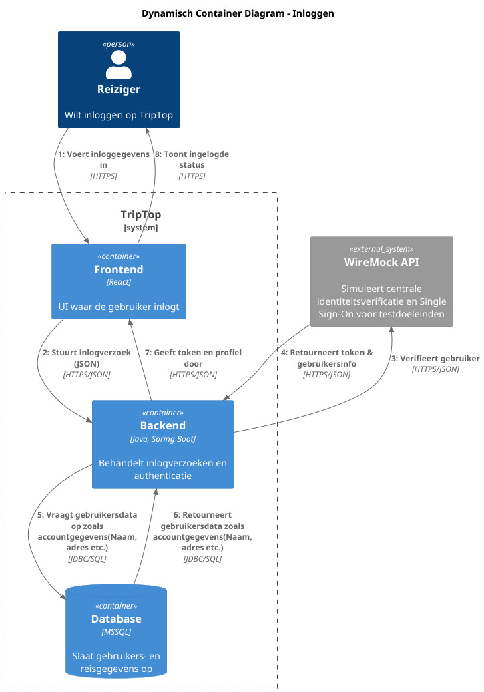

# Software Guidebook Triptop

## 1. Introduction
Dit software guidebook geeft een overzicht van de Triptop-applicatie. Het bevat een samenvatting van het volgende: 
1. De vereisten, beperkingen en principes. 
1. De software-architectuur, met inbegrip van de technologiekeuzes op hoog niveau en de structuur van de software. 
1. De ontwerp- en codebeslissingen die zijn genomen om de software te realiseren.
1. De architectuur van de infrastructuur en hoe de software kan worden geinstalleerd. 

## 2. Context

Triptop is een online platform dat reizigers in staat stelt om reizen zelfstandig te plannen, boeken, annuleren en beheren zonder tussenkomst van een reisbureau. Het platform integreert met diverse externe diensten voor accommodaties, vervoer, activiteiten en betalingen.

### 2.1 System Context Diagram

Het onderstaande diagram toont de context van Triptop, inclusief de gebruikers en externe systemen waarmee het interacteert:

#### Gebruikers:
* **Reiziger**: Plant, boekt, annuleert en beheert reizen zelfstandig op basis van persoonlijke voorkeuren.
* **Reis Agent**: Biedt tweedelijns ondersteuning aan reizigers met vragen of problemen.

#### Externe Systemen:
* **Overnachtingen** (Booking): Leveren accommodatiemogelijkheden.
* **Autohuur** (Booking): Bieden huurauto-opties voor reizigers.
* **Activiteiten** (Tripadvisor): Leveren excursies en activiteiten op locatie.
* **Vervoer** (Deutsche Bahn): Zorgen voor vervoersopties tussen overnachtingslocaties.
* **Routeplanner** (Google Maps API): Genereert routes voor de gewenste reispunten.
* **Eten & Drinken** (UberEats API): Bieden maaltijd- en restaurantopties.
* **Identity Provider** (WireMock): Zorgt voor centrale aanmelding zonder extra account.
* **BetalingsProvider** (Stripe API): Verwerkt betalingen voor boekingen.

## 3. Functional Overview

Om de belangrijkste features toe te lichten zijn er user stories en twee domain stories gemaakt en een overzicht van het domein in de vorm van een domeinmodel. Op deze plek staat typisch een user story map maar die ontbreekt in dit voorbeeld.

### 3.1 User Stories

#### 3.1.1 User Story 1: Reis plannen

Als gebruiker wil ik een zelfstandig op basis van diverse variabelen (bouwstenen) een reis kunnen plannen op basis van mijn reisvoorkeuren (wel/niet duurzaam reizen, budget/prijsklasse, 's nachts reizen of overdag etc.) zodat ik op vakantie kan gaan zonder dat hiervoor een reisbureau benodigd is.

#### 3.1.2 User Story 2: Reis boeken

Als gebruiker wil ik een geplande reis als geheel of per variabele (bouwsteen) boeken en betalen zodat ik op vakantie kan gaan zonder dat hiervoor een reisbureau benodigd is.

#### 3.1.3 User Story 3: Reis cancelen

Als gebruiker wil ik een geboekte reis, of delen daarvan, kunnen annuleren zodat ik mijn geld terug kan krijgen zonder inmenging van een intermediair zoals een reisbureau.

#### 3.1.4 User Story 4: Reisstatus bewaren 

Als gebruiker wil ik mijn reisstatus kunnen bewaren zonder dat ik een extra account hoef aan te maken zodat ik mijn reis kan volgen zonder dat ik daarvoor extra handelingen moet verrichten.

#### 3.1.5 User Story 5: Bouwstenen flexibel uitbreiden

Als gebruiker wil ik de bouwstenen van mijn reis flexibel kunnen uitbreiden met een zelf te managen stap (bijv. met providers die niet standaard worden aangeboden zoals een andere reisorganisatie, hotelketen etc.) zodat ik mijn reis helemaal kan aanpassen aan mijn wensen.

### 3.2 Domain Story Reis Boeken (AS IS)

### 3.3 Domain Story Reis Boeken (TO BE)

### 3.4 Domain Model

## 4. Quality Attributes

Voordat deze casusomschrijving tot stand kwam, heeft de opdrachtgever de volgende ISO 25010 kwaliteitsattributen benoemd als belangrijk:
* Compatibility -> Interoperability (Degree to which a system, product or component can exchange information with other products and mutually use the information that has been exchanged)
* Reliability -> Fault Tolerance (Degree to which a system or component operates as intended despite the presence of hardware or software faults)
* Maintainability -> Modularity (Degree to which a system or computer program is composed of discrete components such that a change to one component has minimal impact on other components)
* Maintainability -> Modifiability (Degree to which a product or system can be effectively and efficiently modified without introducing defects or degrading existing product quality)
* Security -> Integrity (Degree to which a system, product or component ensures that the state of its system and data are protected from unauthorized modification or deletion either by malicious action or computer error)
* Security -> Confidentiality (Degree to which a system, product or component ensures that data are accessible only to those authorized to have access)

## 5. Constraints

> [!IMPORTANT]
> Beschrijf zelf de beperkingen die op voorhand bekend zijn die invloed hebben op keuzes die wel of niet gemaakt kunnen of mogen worden.

## 6. Principles

> [!IMPORTANT]
> Beschrijf zelf de belangrijkste architecturele en design principes die zijn toegepast in de software.

## 7. Software Architecture

###     7.1. Containers
Het volgende diagram toont de hoofdcomponenten van het Triptop-systeem en hun interacties:

#### Hoofdcomponenten:
* **Frontend**: React/JavaScript applicatie die gebruikers in staat stelt om reizen te plannen, boeken en beheren.
* **Backend**: Java/Spring Boot applicatie die boekingen verwerkt, bouwstenen beheert en externe diensten integreert.
* **Database**: Slaat reis- en gebruikersgegevens op.

De container diagram toont in meer detail hoe Triptop integreert met de verschillende externe diensten via API's en hoe de interne componenten met elkaar communiceren.
### 2.2 Dynamische Container Diagram
### 7.2.1  Inloggen

Toelichting

    Gebruiker voert inloggegevens in:
    De gebruiker typt zijn gebruikersnaam en wachtwoord in de Frontend (de gebruikersinterface gebouwd met React). Deze stap vindt plaats via een beveiligde HTTPS-verbinding.

    Verzenden van het inlogverzoek:
    De Frontend stuurt het inlogverzoek (in JSON-formaat) naar de Backend, die is gebouwd met Java en Spring Boot.

    Authenticatie door de externe identiteitprovider:
    De Backend stuurt het verzoek door naar de WireMock API, die in dit geval een externe service is die de centrale identiteitsverificatie en SSO (Single Sign-On) simuleert. Deze service controleert de inloggegevens en retourneert een token en gebruikersinformatie.

    Ophalen en verwerken van gebruikersdata:
    Na ontvangst van het token vraagt de Backend via JDBC/SQL de bijbehorende gebruikersgegevens op uit de Database.

    Terugkoppeling naar de Frontend:
    De Backend stuurt het token en de profielinformatie terug naar de Frontend, die deze informatie vervolgens toont aan de gebruiker, zodat deze als ingelogd wordt herkend.

### 7.2.2 Reis Boeken

Toelichting

    Selectie van reis:
    De gebruiker kiest via de Frontend (React) de vertrek- en bestemmingslocatie en geeft aan dat hij een reis met vervoer met een huurauto wil boeken. Deze selectie vindt plaats via een HTTPS-verbinding.

    Verzenden van reisgegevens:
    De Frontend stuurt de geselecteerde reisdetails (in JSON) naar de Backend (Java/Spring Boot). Dit omvat informatie zoals de locaties, de gewenste datum en tijd, en de keuze voor een huurauto als vervoersmiddel.

    Route-informatie opvragen:
    De Backend vraagt via de Maps API de routeinformatie op, zoals afstand en reistijd tussen de vertrek- en bestemmingslocatie. De Maps API retourneert deze gegevens weer via HTTPS/JSON.

    Huurauto boeken:
    Vervolgens roept de Backend de Booking API aan om de huurauto te reserveren. Hierbij worden onder andere de start- en einddatum en locatiegegevens meegegeven. De Booking API bevestigt de reservering.

    Betaling verwerken:
    Na de reservering verwerkt de Backend de betaling via de Stripe API. Stripe verwerkt de betaling en retourneert een betaalbevestiging.

    Opslag van de transactie:
    De Backend slaat alle reis-, reserverings- en betalingsgegevens op in de Database (via JDBC/SQL).

    Terugkoppeling naar de gebruiker:
    Ten slotte stuurt de Backend een definitieve bevestiging, inclusief reserveringsnummer en betaalstatus, terug naar de Frontend. De Frontend toont deze bevestiging aan de gebruiker.

    Herstart van het proces:
    Indien de betaling mislukt, zal de gebruiker de boeking opnieuw moeten maken, omdat de data pas wordt opgeslagen in de database nadat de betaling is afgerond.

###     7.2. Components

> [!IMPORTANT]
> Voeg toe: Component Diagram plus een Dynamic Diagram van een aantal scenario's inclusief begeleidende tekst.

###     7.3. Design & Code

> [!IMPORTANT]
> Voeg toe: Per ontwerpvraag een Class Diagram plus een Sequence Diagram van een aantal scenario's inclusief begeleidende tekst.

## 8. Architectural Decision Records

> [!IMPORTANT]
> Voeg toe: 3 tot 5 ADR's die beslissingen beschrijven die zijn genomen tijdens het ontwerpen en bouwen van de software.
Hieronder volgt de volledige lijst van alle ADR's die tot op heden zijn opgesteld voor het Triptop-project. Elk document beschrijft een kritische architecturale of technologische keuze, inclusief de relevante context, de overwogen opties (met bijbehorende beslissingsfactoren), de uiteindelijke beslissing en de gevolgen voor het project. Deze ADR's vormen samen de basis voor de verdere ontwikkeling en implementatie van de Triptop-applicatie.

---

## ADR-001: Keuze van Payment Service Provider (PSP)

#### Status
Geaccepteerd

#### Context
Onze Triptop-applicatie heeft een geïntegreerd betalingssysteem nodig dat een consistente gebruikerservaring biedt. In plaats van een eigen betaalinfrastructuur te bouwen, maken we gebruik van externe betalingsproviders. We overwegen zowel dedicated PSP’s (zoals Stripe, Adyen en PayPal) als de optie **Externe API-betalingen**. Bij externe API-betalingen handelen we de betaling af via API’s van partners (bijvoorbeeld via platforms zoals UberEats) die direct geld innen via een enkel endpoint. Hoewel dit vanuit gebruikersperspectief aantrekkelijk lijkt, brengt het een hoge afhankelijkheid en extra integratiecomplexiteit met zich mee.

#### Overwogen opties (Beslissingsfactoren)

| **Criteria**                | **Stripe** | **Adyen** | **PayPal** | **Externe API-betalingen** | **Eigen infrastructuur** |
|-----------------------------|:----------:|:---------:|:----------:|:--------------------------:|:------------------------:|
| **Uniformiteit**            |     ++    |    ++     |     +     |             -              |            -           |
| **Veiligheid & Regels**     |     ++    |    ++     |     +     |             -              |            -           |
| **Schaalbaarheid**          |     ++    |    ++     |     +     |             -              |            -           |
| **Technische Moeilijkheid** |     ++    |     +     |     +     |             -              |            --          |
| **Afhankelijkheid**         |     ++    |    ++     |     +     |             --             |            --          |
| **Kosten**                  |     +     |     +     |     +     |             ?              |            -           |
| **Gratis (Sandbox/Test)**   |     ++    |     +     |    ++     |             -              |            --          |

#### Beslissing
Hoewel zowel Stripe als Adyen sterke scores behalen op uniformiteit, veiligheid en schaalbaarheid, onderscheidt Stripe zich door een superieure developer experience en een zeer toegankelijke gratis sandbox-omgeving. Deze factoren maken de integratie eenvoudiger en versnellen onze time-to-market. Daarom kiezen we voor **Stripe** als onze primaire PSP.

#### Consequenties
- **Uniforme Betalingsmethode:** Alle transacties verlopen via Stripe, wat zorgt voor een consistente gebruikerservaring.
- **Veiligheid:** Stripe voldoet aan strikte veiligheidsnormen, essentieel voor de bescherming van gevoelige betalingsgegevens.
- **Schaalbaarheid:** Het systeem kan eenvoudig meegroeien met een toenemend gebruikersaantal zonder significante extra investeringen.
- **Integratie:** De developer-friendly API en uitstekende documentatie zorgen voor een gestandaardiseerde en relatief eenvoudige implementatie.
- **Afhankelijkheid:** Hoewel we afhankelijk zijn van een externe provider, is dit risico beheersbaar via duidelijke contracten en SLA’s.
- **Kosten:** De transactiekosten zijn marktconform en voorspelbaar; eventuele tariefwijzigingen worden nauwlettend gemonitord.
- **Gratis (Sandbox/Test):** De robuuste, gratis sandbox-omgeving van Stripe versnelt de integratie- en testfase aanzienlijk.

---

## ADR-002: Besluit over API voor routebeschrijving

#### Status
Geaccepteerd

#### Context
Onze applicatie heeft een API nodig die routebeschrijvingen kan genereren. De API moet nauwkeurige route-informatie bieden, goed schaalbaar zijn en eenvoudig te integreren zijn in de bestaande infrastructuur.

#### Overwogen opties (Beslissingsfactoren)

| **Criteria**               | **RapidAPI** | **Google Maps API** | **Mapbox Directions API** |
|----------------------------|--------------|---------------------|---------------------------|
| **Nauwkeurigheid**         | --           | ++                  | +                         |
| **Kosten**                 | ++           | --                  | -                         |
| **Integratiegemak**        | ++           | ++                  | ++                        |
| **Beschikbaarheid**        | +            | ++                  | ++                        |
| **Visualisatie opties**    | --           | ++                  | ++                        |
| **Documentatie**           | +            | ++                  | +                         |

#### Beslissing
We kiezen voor **RapidAPI** omdat deze optie geen kosten met zich meebrengt en geen creditcard vereist voor gebruik. Hoewel het een "fake" API betreft en alleen een JSON-bestand met routebeschrijving levert (zonder visuele weergave), biedt het voldoende functionaliteit voor testdoeleinden.

#### Consequenties
- **Integratie:** Eenvoudige en kosteneffectieve integratie.
- **Nauwkeurigheid & Visualisatie:** De beperkte nauwkeurigheid en visuele ondersteuning zijn acceptabel voor de testfase.
- **Toekomst:** Indien de functionele eisen in de toekomst veranderen, kan er eventueel worden gemigreerd naar een andere API.

---

## ADR-003: Framework keuze voor TripTop-systeem

#### Status
Geaccepteerd

#### Context
Voor het realiseren van een werkend prototype is het essentieel het juiste framework te kiezen. Het gekozen framework moet:
- Eenvoudig in gebruik zijn.
- Een acceptabele opstarttijd en geheugengebruik hebben.
- Beschikken over een robuust ecosysteem en brede community-ondersteuning.
- Direct aansluiten bij de kennis en ervaring van het team.

#### Overwogen opties (Beslissingsfactoren)

| **Criteria**               | **Spring Boot** | **Quarkus** | **Micronaut** | **Jakarta EE** | **Vert.x** | **Dropwizard** | **Helidon** |
|----------------------------|:---------------:|:-----------:|:-------------:|:--------------:|:----------:|:--------------:|:-----------:|
| **Makkelijk in gebruik**   | ++              | +           | +             | -              | --         | +              | -           |
| **Opstarttijd**            | -               | ++          | +             | --             | ++         | 0              | +           |
| **Geheugengebruik**        | -               | ++          | +             | 0              | ++         | 0              | +           |
| **Community & Ecosysteem** | ++              | +           | +             | 0              | -          | 0              | -           |
| **Team Ervaring**          | ++              | --          | --            | --             | --         | --             | --          |

#### Beslissing
Wij kiezen voor **Spring Boot** vanwege de uitstekende gebruiksvriendelijkheid, uitgebreide documentatie en omdat ons team hier veel ervaring mee heeft. Dit zorgt voor een kortere implementatietijd en snellere probleemoplossing.

#### Consequenties
- **Versneld ontwikkelproces:** Door de bekende technologie kan het prototype snel worden ontwikkeld.
- **Betrouwbaarheid:** De grote community en robuuste ondersteuning zorgen voor een stabiele basis.
- **Minder leertijd:** De bestaande kennis binnen het team leidt tot lagere ontwikkelkosten.
- **Beperkte optimalisatie:** Nadelen op het gebied van opstarttijd en geheugengebruik zijn in de context van een prototype acceptabel.

---

## ADR-004: API Gateway keuze voor TripTop-systeem

#### Status
Geaccepteerd

#### Context
Voor het TripTop-systeem is overwogen een API gateway te implementeren als tussenlaag tussen onze backend en externe services. Een API gateway kan zorgen voor gecentraliseerde authenticatie, rate limiting en monitoring, maar brengt ook extra complexiteit met zich mee.

#### Overwogen opties (Beslissingsfactoren)

| **Criteria**                    | **Geen API Gateway** | **API Gateway Implementatie** | **Backend-for-Frontend (BFF)** |
|---------------------------------|----------------------|-------------------------------|--------------------------------|
| **Architectuur complexiteit**   | ++                   | -                             | --                             |
| **Latentie**                    | ++                   | -                             | +                              |
| **Kosten**                      | ++                   | --                            | -                              |
| **Beheer & onderhoud**          | +                    | -                             | --                             |
| **Schaalbaarheid**              | -                    | ++                            | +                              |
| **Ontwikkelingssnelheid**       | ++                   | -                             | +                              |

#### Beslissing
Wij kiezen ervoor **geen API Gateway** te implementeren. Onze backend communiceert direct met externe services via REST API’s, wat leidt tot een eenvoudigere architectuur en snellere ontwikkeling.

#### Consequenties
- **Lagere kosten & eenvoudiger beheer:** Minder componenten om te onderhouden.
- **Snellere responstijden:** Directe communicatie met externe services.
- **Geen centrale plek voor cross-cutting concerns:** Zaken zoals rate limiting en monitoring moeten elders worden opgevangen.
- **Schaalbaarheid:** Mogelijke uitdagingen bij toekomstige groei, maar voor de huidige schaal past de directe aanpak het best.

---

## ADR-005: Database Keuze voor Triptop-systeem

#### Status
Geaccepteerd

#### Context
Triptop is een online platform dat reizigers in staat stelt om zelfstandig reizen te plannen, boeken, annuleren en beheren. Aangezien kritieke gegevens zoals boekingen, gebruikersprofielen, reis- en betalingsinformatie worden verwerkt, is het essentieel dat de gekozen database:
- Sterke transactionele integriteit (ACID-naleving) biedt.
- Hoge dataconsistentie garandeert.
- Beschikt over een robuust ecosysteem en goede ondersteuning.
- Schaalbaar is voor groeiende gebruikersaantallen.
- Kosteneffectief is en aansluit bij de bestaande expertise van het team.

Gezien de uitgebreide ervaring van ons team met MSSQL en het feit dat we MSSQL kosteloos kunnen gebruiken, is dit een belangrijke factor in onze beslissing.

#### Overwogen opties (Beslissingsfactoren)

| **Criteria**                      | **MSSQL** | **PostgreSQL** | **MongoDB** |
|-----------------------------------|:---------:|:--------------:|:-----------:|
| **ACID-naleving**                 | ++        | ++             | --          |
| **Dataconsistentie**              | ++        | ++             | --          |
| **Schaalbaarheid**                | +         | +              | ++          |
| **Community & Ecosysteem**        | +         | ++             | +           |
| **Gebruiksgemak**                 | ++        | +              | +           |
| **Licenties & Kosten**            | ++        | ++             | ++          |
| **Team Ervaring**                 | ++        | +              | --          |

*Opmerking: In onze context kunnen we MSSQL gratis gebruiken, wat resulteert in een score van "++" bij Licenties & Kosten.*

#### Beslissing
Wij kiezen voor **MSSQL** als onze primaire database-oplossing voor Triptop. Deze keuze is gebaseerd op:
- **Team Ervaring:** Ons team heeft uitgebreide ervaring met MSSQL, wat zorgt voor een kortere implementatietijd en snellere probleemoplossing.
- **Gebruiksgemak:** MSSQL biedt een geïntegreerde, ontwikkelaarsvriendelijke omgeving met uitgebreide tooling en ondersteuning.
- **Transactionele Integriteit & Dataconsistentie:** MSSQL voldoet volledig aan de ACID-vereisten, essentieel voor het verwerken van boekingen en betalingen.
- **Licenties & Kosten:** Aangezien we MSSQL gratis kunnen gebruiken, vormen de licentiekosten geen belemmering.

#### Consequenties
- **Transactionele Integriteit:** Robuuste ACID-naleving garandeert betrouwbare verwerking van boekingen en betalingen.
- **Dataconsistentie:** Essentiële gegevens blijven consistent en betrouwbaar.
- **Gebruiksgemak en Ondersteuning:** De uitgebreide ervaring van het team met MSSQL leidt tot een snellere implementatie en efficiëntere probleemoplossing.
- **Schaalbaarheid:** MSSQL voldoet ruim voldoende aan de huidige en nabije toekomstige eisen.
- **Licentiekosten:** Geen bijkomende kosten dankzij gratis gebruik, wat de totale investering verlaagt.
- **Ecosysteem:** MSSQL biedt een stabiel en uitgebreid ecosysteem met ondersteuning vanuit Microsoft.

---

### 8.5. ADR-005 TITLE

> [!TIP]
> These documents have names that are short noun phrases. For example, "ADR 1: Deployment on Ruby on Rails 3.0.10" or "ADR 9: LDAP for Multitenant Integration". The whole ADR should be one or two pages long. We will write each ADR as if it is a conversation with a future developer. This requires good writing style, with full sentences organized into paragraphs. Bullets are acceptable only for visual style, not as an excuse for writing sentence fragments. (Bullets kill people, even PowerPoint bullets.)

#### Context

> [!TIP]
> This section describes the forces at play, including technological, political, social, and project local. These forces are probably in tension, and should be called out as such. The language in this section is value-neutral. It is simply describing facts about the problem we're facing and points out factors to take into account or to weigh when making the final decision.

#### Considered Options

> [!TIP]
> This section describes the options that were considered, and gives some indication as to why the chosen option was selected.

#### Decision

> [!TIP]
> This section describes our response to the forces/problem. It is stated in full sentences, with active voice. "We will …"

#### Status

> [!TIP]
> A decision may be "proposed" if the project stakeholders haven't agreed with it yet, or "accepted" once it is agreed. If a later ADR changes or reverses a decision, it may be marked as "deprecated" or "superseded" with a reference to its replacement.

#### Consequences

> [!TIP]
> This section describes the resulting context, after applying the decision. All consequences should be listed here, not just the "positive" ones. A particular decision may have positive, negative, and neutral consequences, but all of them affect the team and project in the future.

## 10. API Mapping

| **Class::attribuut**                 | **Is input voor API+Endpoint**                                                          | **Wordt gevuld door API+Endpoint**                                              | **Wordt geleverd door eindgebruiker** | **Moet worden opgeslagen in de applicatie** |
|--------------------------------------|-----------------------------------------------------------------------------------------|--------------------------------------------------------------------------------|---------------------------------------|-------------------------------------------|
| **Reiziger::telefoonnummer**         | - (Intern gebruik)                                                                      | -                                                                              | X                                     | X                                         |
| **Reiziger::postcode**               | - (Intern gebruik)                                                                      | -                                                                              | X                                     | X                                         |
| **Reiziger::huisnummer**             | - (Intern gebruik)                                                                      | -                                                                              | X                                     | X                                         |
| **Reiziger::maakTrip()**            | - (Interne methode, geen directe API-koppeling)                                        | -                                                                              | -                                     | -                                         |
| **Reisbureaumedewerker::functieTitel** | - (Intern gebruik)                                                                     | -                                                                              | X (wordt intern beheerd)              | X                                         |
| **Reisbureaumedewerker::maakReservering()** | - (Interne methode)                                                                   | -                                                                              | -                                     | -                                         |
| **TriptopGebruiker::voornaam**       | Stripe /v1/customers (POST)                                                             | -                                                                              | X                                     | X                                         |
| **TriptopGebruiker::tussenvoegsels** | - (Intern, geen directe API-koppeling)                                                 | -                                                                              | X                                     | X                                         |
| **TriptopGebruiker::achternaam**     | Stripe /v1/customers (POST)                                                             | -                                                                              | X                                     | X                                         |
| **TriptopGebruiker::email**          | Stripe /v1/customers (POST)                                                             | -                                                                              | X                                     | X                                         |
| **TriptopGebruiker::wachtwoord**     | - (Intern gebruik, geen externe API)                                                   | -                                                                              | X                                     | X (gehasht)                               |
| **Trip::startDatum**                 | Booking.com /searchHotels (GET) – `arrival_date` NS /arrivals (GET) – `dateTime`    | Booking.com retourneert beschikbare kamers/prijzen NS API geeft reisinformatie (arrivals/vertrektijden) | X (gebruiker kiest begin van de trip)  | X                                         |
| **Trip::eindDatum**                  | Booking.com /searchHotels (GET) – `departure_date`                                      | Booking.com retourneert kamerprijzen tot en met deze datum                     | X (gebruiker kiest eind van de trip)   | X                                         |
| **Trip::budget**                     | - (Eventueel input bij betaling in Stripe)                                              | -                                                                              | X (gebruiker stelt budget in)          | X                                         |
| **Trip::berekenDuur()**             | - (Interne methode)                                                                     | -                                                                              | -                                     | -                                         |
| **Trip::berekenPrijs()**            | Stripe /v1/payment_intents (POST) (bijv. `amount`)                                      | Stripe retourneert bevestiging van bedrag/betaling                             | -                                     | X                                         |
| **Trip::bepaalDuurzaamheidsScore()** | - (Interne methode, geen directe API)                                                  | -                                                                              | -                                     | -                                         |
| **Excursie::titel, datum, prijs**    | Booking.com /searchAttractionLocation (GET) of /searchAttractions (GET)                | Booking.com retourneert details (naam, availability, reviews)                  | X (gebruiker kiest excursie)           | X                                         |
| **Verblijf::startDatum, eindDatum**  | Booking.com /searchHotels (GET)                                                        | Booking.com retourneert beschikbare hotels                                     | X (gebruiker kiest verblijfsperiode)   | X                                         |
| **Verblijfplaats::locatie, prijs**   | Booking.com /searchHotels (GET) – `dest_id`, `arrival_date`, `departure_date`           | API retourneert hotelinformatie (prijs, adres, etc.)                           | -                                     | X                                         |
| **Locatie::lat, lon**                | Maps API /searchmaps (GET): parameter `query`                                          | Maps API retourneert coördinaten, naam, etc.                                   | X (gebruiker zoekt bijv. "amsterdam")  | X                                         |
| **Reis::startDatum, eindDatum**      | NS /arrivals (GET) – bijv. param `station`, `dateTime`                                 | NS API retourneert info over vertrektijden, aankomst, storingen                | -                                     | X                                         |
| **Reis::vervoer**                    | - (Kan intern HUURAUTO, TREIN, etc. zijn)                                              | -                                                                              | X (gebruiker kiest vervoerstype)       | X                                         |
| **Reis::prijs**                      | Stripe /v1/payment_intents (POST) (bijv. `amount`)                                      | Stripe retourneert betaalbevestiging                                           | -                                     | X                                         |
| **Reservering::reserveringsnummer**  | Stripe /v1/payment_intents (POST)                                                      | Stripe genereert payment_intent_id                                             | -                                     | X                                         |
| **Reservering::status**             | -                                                                                      | Stripe /v1/payment_intents/{id} (GET) retourneert status                       | -                                     | X                                         |

## 9. Deployment, Operation and Support

> [!TIP]
> Zelf beschrijven van wat je moet doen om de software te installeren en te kunnen runnen.