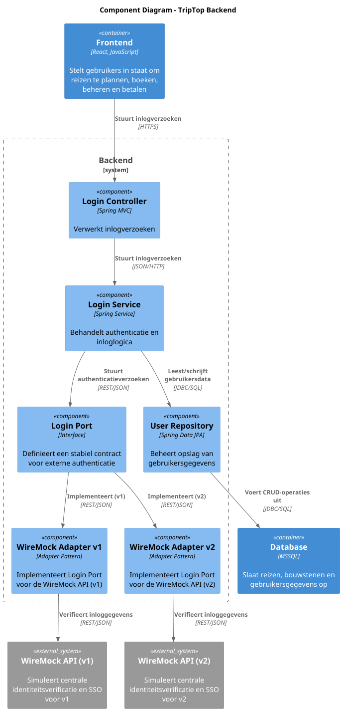
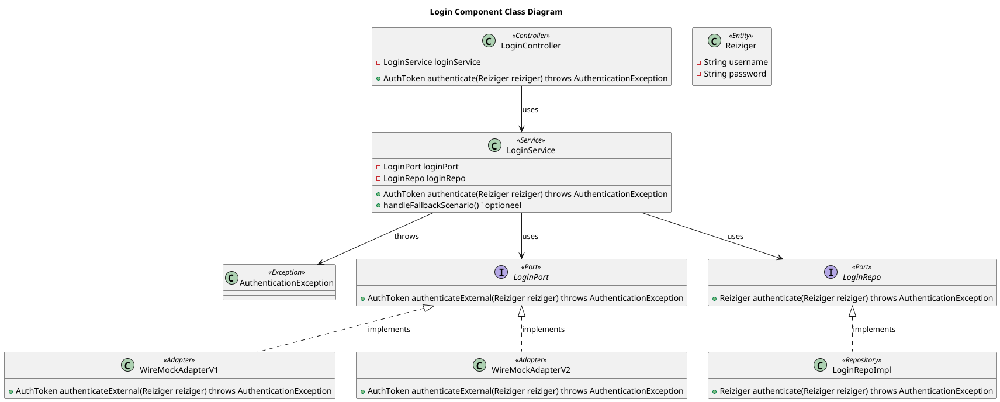
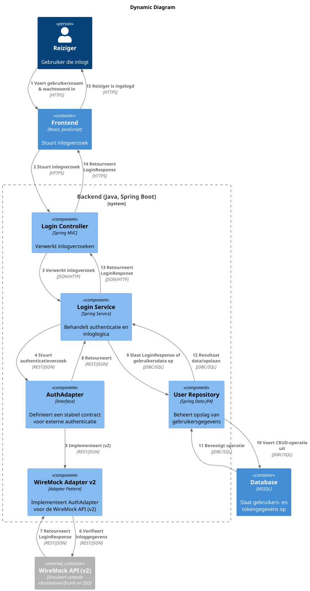

### Ontwerpvraag
Hoe zorg je dat een wijziging in een of meerdere APIs niet leidt tot een
grote wijziging in de applicatie? Specifieker: hoe zorg je ervoor dat
een wijziging in de API van een externe service niet leidt tot een
wijziging in de front-end maar flexibel kan worden opgevangen door de
back-end?

### Design Pattern en Principe Keuze

Voor mijn design pattern keuze heb ik gekozen voor het Adapter Pattern. Dit pattern maakt het mogelijk om de communicatie met externe authenticatieproviders op een uniforme en uitbreidbare wijze te organiseren. In dit geval integreer ik met de WireMock API, waarbij ik twee versies onderhoud (WireMock Adapter v1 en v2). Dankzij het Adapter Pattern kan de Login Service eenvoudig overschakelen tussen verschillende adapter-implementaties of nieuwe versies toevoegen zonder de bestaande code te wijzigen. Dit sluit naadloos aan bij het Open/Closed Principe, omdat het systeem open is voor uitbreiding maar gesloten voor modificatie.

Daarnaast pas ik het Single Responsibility Principe toe, wat betekent dat elke klasse slechts één specifieke verantwoordelijkheid heeft. De Login Controller verwerkt alleen de inlogverzoeken, de Login Service beheert de businesslogica, en de adapters (via de Login Port) zorgen voor de communicatie met de externe API. Deze duidelijke scheiding van verantwoordelijkheden maakt het systeem eenvoudiger te onderhouden en te testen.

Door meerdere versies van de WireMock Adapter te behouden, kan ik bestaande functionaliteit ondersteunen terwijl ik nieuwe versies geleidelijk implementeer. Hierdoor blijft de front-end stabiel, zelfs als de externe API verandert.

---

### COMPONENT DIAGRAM

Door de adapters en de port op te nemen in het code diagram laat ik duidelijk zien hoe de verschillende lagen met elkaar communiceren en hoe de verantwoordelijkheden verdeeld zijn. De Login Port fungeert als een vast contract tussen de Login Service en de externe API's. Dit betekent dat de service alleen met de port hoeft te werken, ongeacht welke concrete adapter er wordt gebruikt. De concrete adapters, zoals WireMock Adapter v1 en v2, vertalen de interne verzoeken naar de juiste externe API-aanroepen. Hierdoor blijft de interne logica van de applicatie onveranderd, zelfs als de externe API verandert.

De oude versie, in dit geval WireMock Adapter v1, wordt behouden zodat bestaande functionaliteit en gebruikers niet direct worden getroffen door eventuele wijzigingen in de externe API. Op deze manier kunnen we stap voor stap overstappen naar de nieuwe versie (v2) terwijl de oude versie nog steeds operationeel blijft. Dit zorgt ervoor dat de front-end stabiel blijft, omdat het alleen communiceert met een vast contract (de Login Port) en niet direct met de veranderende externe API's. Deze aanpak maakt de architectuur flexibel, onderhoudbaar en minder gevoelig voor brekende wijzigingen.

---

### CODE DIAGRAM

    
---
### DYNAMIC DIAGRAM

