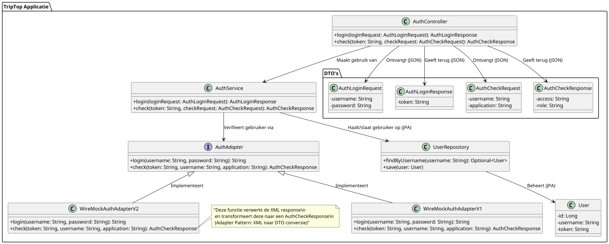

### Design Pattern en Principe Keuze

Voor mijn design pattern keuze heb ik gekozen voor het **Adapter Pattern**. Dit pattern maakt het mogelijk om externe authenticatieproviders, zoals de WireMock API en Google Auth API, op een uniforme en uitbreidbare wijze te integreren. Dankzij het Adapter Pattern kan de Login Service eenvoudig overschakelen tussen verschillende externe providers of nieuwe providers toevoegen zonder de bestaande code te wijzigen. Dit sluit naadloos aan bij het **Open/Closed Principe**, waarbij het systeem open is voor uitbreiding maar gesloten voor aanpassingen.

Daarnaast pas ik het **Single Responsibility Principe** toe, wat inhoudt dat elke klasse slechts één specifieke verantwoordelijkheid heeft. Zo is de Login Controller uitsluitend verantwoordelijk voor het verwerken van authenticatieaanvragen, terwijl de Login Service de businesslogica beheert en de adapter (via de IdentityProviderAdapter interface) de communicatie met externe systemen afhandelt. Deze duidelijke scheiding van verantwoordelijkheden zorgt voor een beter onderhoudbaar en testbaar systeem.

---
### COMPONENT DIAGRAM

Ik gebruik een aparte Login Port omdat ik hiermee duidelijk maak waar de grens ligt tussen de interne logica van mijn Login Service en de externe authenticatieproviders. Mijn Login Service praat namelijk niet direct met externe systemen. In plaats daarvan gaat alle communicatie via een afgesproken contract, de Login Port. Hierdoor blijft mijn systeem netjes en losgekoppeld.

In plaats van één algemene Login Adapter heb ik ervoor gekozen om twee aparte componenten te maken. De WireMock Adapter verzorgt de communicatie met de WireMock API, en de Google Auth Adapter regelt de communicatie met de Google Auth API. Dit maakt mijn systeem uitbreidbaar, want als ik in de toekomst een nieuwe externe provider wil toevoegen, kan ik simpelweg een nieuwe adapter maken die het contract van de Login Port volgt.

Omdat mijn Login Service alleen weet dat hij met de Login Port werkt, hoeven bij veranderingen aan de externe API’s alleen de bijbehorende adapter aangepast te worden. Dit zorgt voor een losse koppeling en dat nieuwe adapters makkelijk kunnen worden toegevoegd zonder dat ik de bestaande service hoef aan te passen. Bovendien heeft elke component precies één taak: de service verwerkt de logica, de port definieert het contract en de adapters regelen de externe communicatie. Dit maakt mijn systeem eenvoudig te onderhouden en te testen.

---

### CODE DIAGRAM

---

### Samenvatting

- **Adapter Pattern:** Zorgt voor een losgekoppelde integratie van externe authenticatieproviders, waardoor je flexibel kunt inspelen op wijzigingen of uitbreidingen zonder de bestaande code aan te passen.
- **Open/Closed Principe:** Door de toepassing van het Adapter Pattern kun je eenvoudig nieuwe providers toevoegen, wat betekent dat je systeem uitbreidbaar is zonder de bestaande implementatie te veranderen.
- **Single Responsibility Principe:** Elke klasse heeft een duidelijke, afgebakende verantwoordelijkheid, wat leidt tot een beter onderhoudbaar en testbaar systeem.

Deze keuzes maken jouw authenticatie-architectuur robuust, flexibel en future-proof.