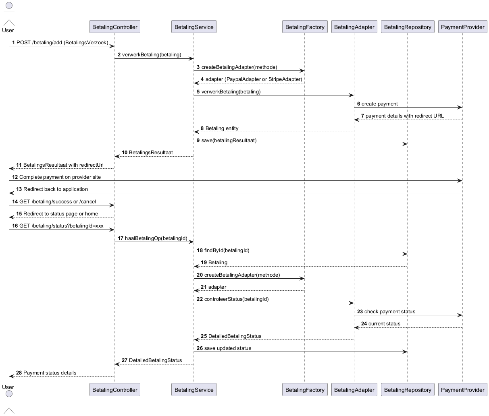

# Hoe kunnen we verschillende betalingssystemen integreren voor de verschillende bouwstenen?

## Componentdiagram

Het componentdiagram laat zien hoe de betalingsmodule past binnen het grotere TripTop ecosysteem:

1. Externe Integraties

Directe verbinding tussen StripeAdapter/PayPalAdapter en externe APIs

Isolatie van externe afhankelijkheden in specifieke adapters

2. Interne Systeemintegratie

De BetalingService communiceert met de factory

De services werken met hun eigen repositories voor persistentie

3. Ontkoppeling en Flexibiliteit

Het systeem is ontworpen om eenvoudig uit te breiden met nieuwe betalingsmethoden

De betalingsverwerking is ontkoppeld van de kernbedrijfslogica

## Klassendiagram
Het klassendiagram toont een doelgerichte architectuur om verschillende betalingssystemen in TripTop te integreren. De belangrijkste ontwerpkeuzes zijn:

1. Adapter Pattern

De BetalingAdapter interface creëert een gestandaardiseerde manier om met verschillende betalingssystemen te communiceren

Specifieke implementaties (StripeAdapter en PayPalAdapter) bevatten de leverancier-specifieke code

Dit patroon zorgt ervoor dat de betalingslogica niet afhankelijk is van specifieke externe systemen

2. Factory Pattern

De BetalingFactory klasse centraliseert het creëren van de juiste adapter gebaseerd op de betalingsmethode

Dit elimineert voorwaardelijke logica (if-else/switch) in de betalingsservice

Nieuwe betalingsmethoden kunnen worden toegevoegd zonder de kerncode aan te passen

3. Gelaagde Architectuur

BetalingController → BetalingService → BetalingAdapter: duidelijke scheiding van verantwoordelijkheden

Data-objecten (BetalingsVerzoek, BetalingsResultaat, Betaling) zorgen voor een duidelijke dataflow

## Conclusie

Deze architectuur biedt een robuuste oplossing voor de vraag "Hoe kunnen we verschillende betalingssystemen integreren voor de verschillende bouwstenen?" door:

Een uniform interfacemechanisme te bieden via het adapter pattern

Flexibiliteit te garanderen voor het toevoegen van nieuwe betalingsproviders

Een duidelijke scheiding te maken tussen betalingsverwerking en bedrijfslogica

Testbaarheid te verbeteren door afhankelijkheden te isoleren

Het systeem toekomstbestendig te maken door uitbreidingen te vereenvoudigen

De combinatie van adapter en factory patterns is een aanpak voor dit type integratiescenario, omdat het de complexiteit van verschillende externe systemen verbergt achter een consistente interface, waardoor de rest van de applicatie kan werken zonder kennis van de specifieke betalingssystemen.