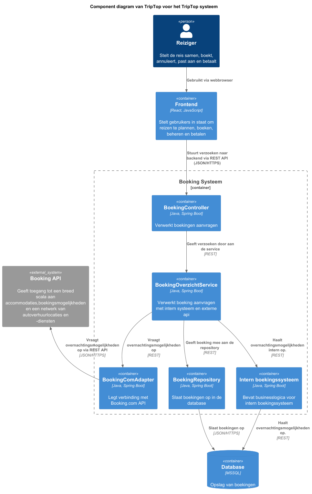
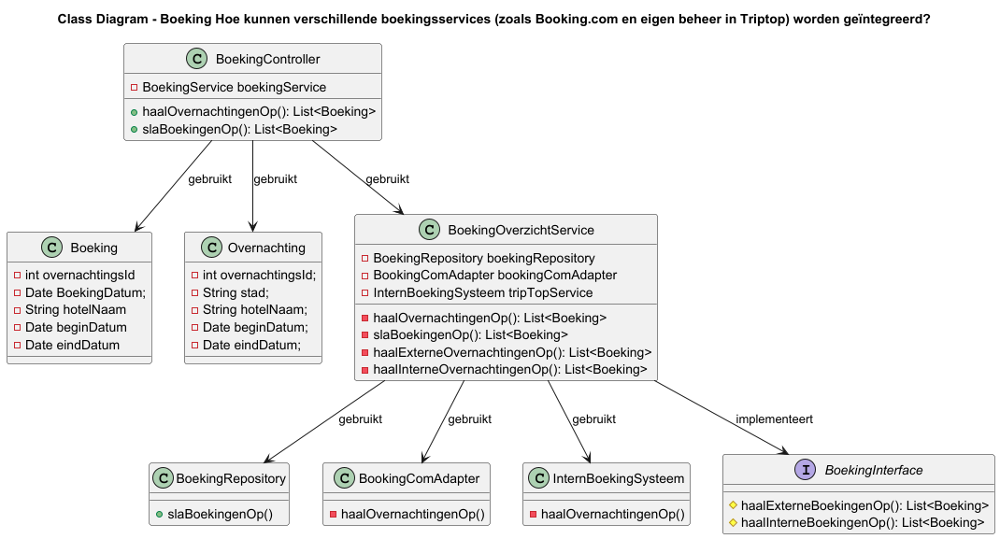
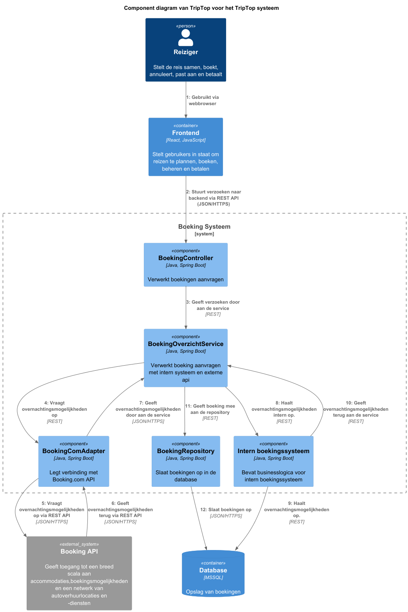

### Ontwerpvraag
Hoe kunnen verschillende boekingsservices (zoals Booking.com en eigen beheer in Triptop) worden geïntegreerd?

### Design Pattern en Principe Keuze
Ik heb gekozen voor het pattern Facade. Dit pattern maakt het mogelijk om door middel van een klasse handelingen uit te voeren 

---

### STATISCHE COMPONENT DIAGRAM

---

### KLASSENDIAGRAM

    
---
### DYNAMIC DIAGRAM

