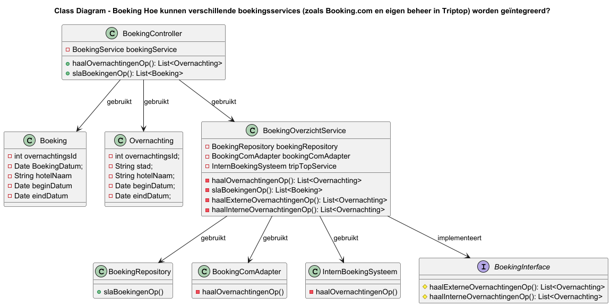

### Ontwerpvraag
Hoe kunnen verschillende boekingsservices (zoals Booking.com en eigen beheer in Triptop) worden geïntegreerd?

### Design Pattern en Principe Keuze
Ik heb gekozen voor het pattern Facade. Dit pattern maakt het mogelijk om door middel van een klasse meerdere handelingen uit te voeren. Zie voor een verdere beargumentatie ADR-006-facade.
Een design principe die op dit ontwerp is toegepast, is de Dependency Inversion.   Dit principe gaat uit van  
---

### STATISCHE COMPONENT DIAGRAM

In dit diagram zie je het boeking systeem van de applicatie TripTop. Dit systeem maakt gebruikt van
twee resources, namelijk een intern boekingssysteem en een extern systeem, namelijk een api van Booking.com. De BoekingOverzichtService zorgt ervoor 
dat er door middel van een functie aanroep overnachtingen opgehaald kunnen worden vanuit beide systeem en dat deze  als een gecombineerde lijst terug gegeven aan de eindgebruiker, de reiziger. 
Daarnaast is er een BookingComAdapter aanwezig. Dit component heeft als veranwoordelijkheid dat de juiste data wordt opgehaald vanuit de Booking.com api en dat deze doorgestuurd worden naar de BoekingOverzichtService.

---

### KLASSENDIAGRAM

In deze klassendiagram zijn twee domein klassen te zien, namelijk Boeking en Overnachting. Er wordt hier onderscheid gemaakt tussen een boeking en overnachting, omdat deze
op een andere manier afgehandeld worden. Er is sprake van een overnachting als de reiziger naar mogelijke opties zoekt. Als een bepaalde overnachting gekozen wordt en deze ook geboekt wordt, is er sprake van een boeking. 

    
---
### DYNAMIC DIAGRAM

